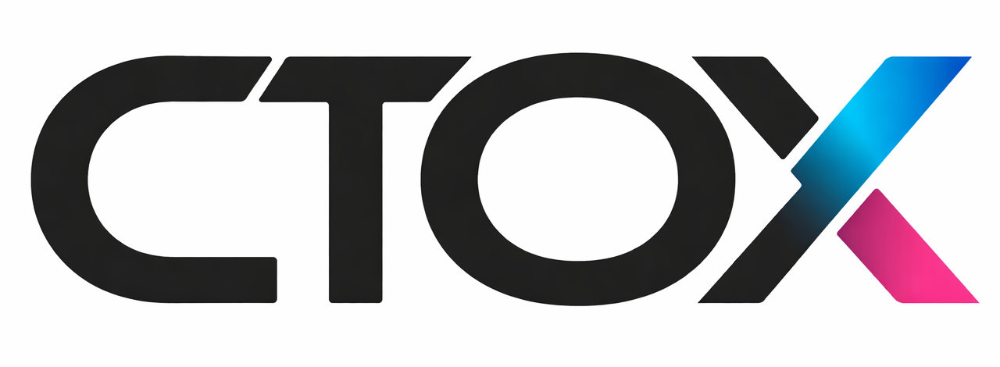
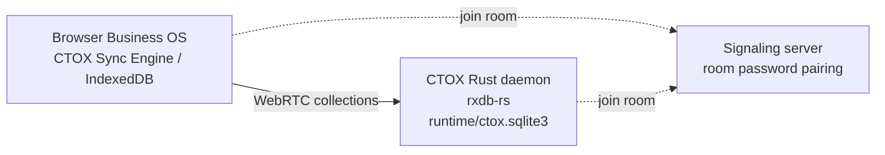

<div align="center">



<p><strong>Self-hosted agent runtime and app platform in a single Rust daemon.</strong></p>

[](https://github.com/metric-space-ai/ctox/releases)
[](LICENSE)
[](https://www.rust-lang.org)
[](https://github.com/metric-space-ai/ctox/commits/main)


[Project page](https://metric-space-ai.github.io/ctox/)
&middot; [Documentation](https://metric-space-ai.github.io/ctox/docs.html)
&middot; [CLI reference](https://metric-space-ai.github.io/ctox/cli.html)
&middot; [Harness guide](HARNESS.md)
&middot; [Releases](https://github.com/metric-space-ai/ctox/releases)

</div>

CTOX is a self-hosted agent runtime and app platform. A single Rust daemon
holds durable work state in SQLite, executes long-running agent work, and
serves Business OS: web app modules delivered to the browser and synced
peer-to-peer over WebRTC. Agents create and modify apps at runtime; every
change is versioned and reversible.

## Features

- **Single binary** — persistent daemon with durable state in
  `runtime/ctox.sqlite3`: work queues, tickets, schedules, verification,
  process mining, and an agent harness. No external services required.
- **Apps as modules** — Business OS apps are HTML/JS/CSS modules served to the
  browser. At startup the runtime provides data access, commands, permissions,
  the signed-in user, windows, files, chat, and notifications.
- **Peer-to-peer sync** — CTOX Sync Engine (`ctox-rxdb-js` in the browser,
  `rxdb-rs` in the daemon) replicates collections over WebRTC between browser
  IndexedDB and daemon SQLite. Signaling carries pairing only (SDP/ICE);
  business data is never proxied over HTTP. It is a CTOX-owned fork reduced to
  the WebRTC-peer scope: not upstream npm `rxdb`, and not a drop-in replacement.
- **Runtime changes** — agents modify module code and SQLite schema in place
  through the daemon, without a build step or redeploy. Every patch is
  SHA-256-hashed and versioned, with one-click rollback.
- **Model backends** — API providers (`openai`, `anthropic`, `openrouter`,
  `minimax`, `azure_foundry`) or local inference (currently
  `Qwen/Qwen3.6-27B` on CUDA). Configured in the TUI; credentials live in the
  CTOX secret store.
- **Cross-platform** — macOS, Linux, Windows. An optional Desktop app (beta)
  installs and manages local and remote instances.

## Installation

```sh
curl -fsSL https://raw.githubusercontent.com/metric-space-ai/ctox/main/install.sh | bash
```

Installer flags, model setup examples, and update commands
(`ctox upgrade --stable`) are documented in the
[installation docs](https://metric-space-ai.github.io/ctox/docs.html#install).

## Quick start

```sh
ctox doctor   # check installation and runtime environment
ctox          # open the TUI: model backend, credentials, communication, autonomy
ctox start    # start the daemon
ctox status   # check service state
ctox chat "Check this CTOX installation and summarize what is configured."
```

`ctox start` also brings up the local Business OS web surface
(`http://127.0.0.1:8765`) and the local MCP endpoint
(`http://127.0.0.1:8788/mcp`); opt out with `--no-business-os-autostart`.

## Architecture



The daemon loop:

```text
intake
  -> durable queue item, ticket, schedule, or plan step
  -> leased worker run
  -> context build from runtime state
  -> bounded agent execution
  -> verification, writeback, knowledge, and process events
  -> complete, blocked, waiting, scheduled, requeued, or continued
```

The unit of work is runtime state, not a chat transcript. Workers can call
CTOX commands themselves (`ctox ticket`, `ctox queue`, `ctox verification`,
`ctox process-mining`), so the daemon inspects and updates its own state
through an auditable command surface.

External agents connect through Business OS MCP, a typed control channel —
locally at `http://127.0.0.1:8788/mcp`. MCP is a control channel; it does not
replace the WebRTC data plane. An agent skill for install, connect, and
operation is available at
[ctox-business-os-deploy-skill](https://github.com/metric-space-ai/ctox-business-os-deploy-skill/tree/main/ctox).

## Documentation

- [Documentation](https://metric-space-ai.github.io/ctox/docs.html) — install,
  configuration, runtime, operations
- [CLI reference](https://metric-space-ai.github.io/ctox/cli.html) — the full
  command surface
- [Project page](https://metric-space-ai.github.io/ctox/) — overview,
  connectivity, downloads
- [HARNESS.md](HARNESS.md) — worker lifecycle, persistent session, context,
  review, recovery, subagents, and liveness proof
  model
- [SECURITY.md](SECURITY.md) — vulnerability reporting, supported versions,
  security model
- [CHANGELOG.md](CHANGELOG.md) — release history and versioning policy

## Development

```sh
cargo fmt --check
cargo check
cargo test
cargo run -- process-mining spawn-liveness
```

Repository layout:

- `src/core/` — daemon, runtime, mission systems, TUI, harness, local inference
- `src/apps/` — Desktop, Business OS, and web app surfaces
- `src/tools/` — supporting packages (web, PDF, document, speech)
- `docs/site/` — the project page (GitHub Pages)
- `tests/` — integration, harness, fixture, and behavior tests

Use the release workflow for production binaries; release builds gate on
`ctox process-mining spawn-liveness`.

## License

[GNU Affero General Public License v3.0](LICENSE)

See [docs/legal/NOTICE](docs/legal/NOTICE) for attribution of integrated source trees.
