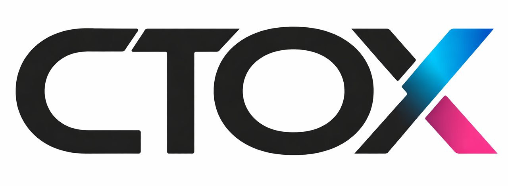
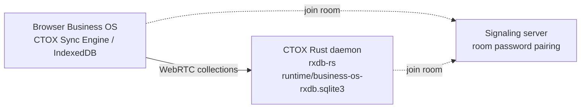

<div align="center">



[](https://github.com/metric-space-ai/ctox/releases)
[](LICENSE)
[](https://www.rust-lang.org)
[](https://github.com/metric-space-ai/ctox/commits/main)

</div>

# CTOX

CTOX is the open-source backend of the Workjet product family. It is a single
Rust daemon with a command-line interface that keeps durable work state in
SQLite, runs long-lived agent work, and serves Business OS, a set of web app
modules that the browser loads and keeps in sync with the daemon over WebRTC.
You install CTOX on a laptop, a workstation, or a server, and from then on it is
the machine that does the work.

## How CTOX relates to Workjet and ctox.dev

The product consists of three parts. CTOX, in this repository, is the backend
and its CLI. [Workjet](https://github.com/metric-space-ai/workjet) is the
application people actually use on desktop and mobile; it installs CTOX,
connects to one or more CTOX instances, and is the only supported user-facing
client. [ctox.dev](https://ctox.dev) is the commercial service around both. It
offers accounts, team access, managed `*.ctox.dev` instances, signaling and TURN
relays, and support. CTOX runs completely without ctox.dev; the service only
adds operation and convenience for those who want it.

The Electron client in `src/apps/business-os-desktop` and the mobile code in
`src/apps/business-os-mobile` are earlier clients that remain in this
repository only as migration donors for Workjet. Neither of them is released.
The [product matrix](docs/product-matrix.md) records which repository ships
which artifact.

## Installation

The installer downloads the current release and places the `ctox` binary on
your path:

```sh
curl -fsSL https://raw.githubusercontent.com/metric-space-ai/ctox/main/install.sh | bash
```

On Windows the same job is done by `install.ps1`. If you use Workjet, you do not
need to run the installer yourself, because Workjet sets up and updates CTOX on
the computers it manages. The [installation docs](https://metric-space-ai.github.io/ctox/docs.html#install)
describe the installer flags and the model setup.

## First steps

`ctox doctor` checks the installation and the runtime environment and reports
anything that is missing. Running `ctox` without arguments opens the terminal
interface, where you choose a model backend, store credentials, connect
communication channels, and decide how autonomously CTOX may act. `ctox start`
starts the daemon, and `ctox status` tells you whether it is running. To see the
whole setup at work, ask the installation to describe itself:

```sh
ctox doctor
ctox
ctox start
ctox status
ctox chat "Check this CTOX installation and summarize what is configured."
```

Once started, the daemon also serves the local Business OS web surface at
`http://127.0.0.1:8765` and the local MCP endpoint at
`http://127.0.0.1:8788/mcp`. If you do not want Business OS to start
automatically, pass `--no-business-os-autostart` to `ctox start`.

Updates come from release channels. `ctox update check` asks the channel whether
a new version exists, `ctox upgrade --stable` installs the current stable
release, `ctox update status` shows the installed layout and update state, and
`ctox update rollback` returns to the previous release slot.

## What the daemon does

Everything CTOX knows lives in `runtime/ctox.sqlite3`: work queues, tickets,
schedules, plans, verification results, and process events. No external
database or message broker is required. Work enters as a queue item, ticket,
schedule, or plan step, a worker leases it, CTOX builds the context from the
runtime state, and an agent runs a bounded piece of work. The result is
verified and written back, and the item ends as completed, blocked, waiting,
scheduled, requeued, or continued.

```text
intake
  -> durable queue item, ticket, schedule, or plan step
  -> leased worker run
  -> context build from runtime state
  -> bounded agent execution
  -> verification, writeback, knowledge, and process events
  -> complete, blocked, waiting, scheduled, requeued, or continued
```

The unit of work is therefore runtime state rather than a chat transcript.
Workers can call CTOX commands such as `ctox ticket`, `ctox queue`,
`ctox verification`, and `ctox process-mining` themselves, so the daemon
inspects and changes its own state through the same auditable command surface
that a person uses. [HARNESS.md](HARNESS.md) describes the worker lifecycle,
context building, review, recovery, subagents, and the liveness proof in detail.

CTOX can work with API providers (`openai`, `anthropic`, `openrouter`,
`minimax`, `ctox_proxy`, `azure_foundry`) or with local inference, currently
`Qwen/Qwen3.6-27B` on CUDA. You configure the backend in the terminal interface,
and credentials are kept in the CTOX secret store. When the authenticated CTOX
proxy is used, CTOX reads the available model IDs from its OpenAI-compatible
`GET /v1/models` endpoint.

## Business OS

Business OS apps are plain HTML, JavaScript, and CSS modules. When an app
starts, the runtime hands it data access, commands, permissions, the signed-in
user, windows, files, chat, and notifications. Agents can create and change
apps while the system is running: they patch module code and the SQLite schema
in place through the daemon, without a build step or redeploy. Every patch is
hashed with SHA-256 and versioned, so any change can be rolled back with one
action.

Data reaches the browser through the CTOX Sync Engine, which
replicates collections over WebRTC between the browser's IndexedDB and the daemon's
SQLite. The browser side is `ctox-rxdb-js`, the daemon side is `rxdb-rs`. It is
a CTOX-owned fork reduced to the WebRTC peer scope, not upstream npm `rxdb`,
and not a drop-in replacement for it. The signaling server only pairs the two
peers by exchanging SDP and ICE, and business data is never proxied over HTTP.


```mermaid
flowchart LR
  Browser["Browser Business OS<br/>CTOX Sync Engine / IndexedDB"] -- "WebRTC collections" --> CTOX["CTOX Rust daemon<br/>rxdb-rs<br/>runtime/business-os-rxdb.sqlite3"]
  Browser -. "join room" .-> Signaling["Signaling server<br/>room password pairing"]
  CTOX -. "join room" .-> Signaling
```

The replicated document store is `runtime/business-os-rxdb.sqlite3`. The
canonical execution state, the command lifecycle, and the link between
commands and queue items live in `runtime/ctox.sqlite3`, and Business OS domain
data is kept in `runtime/business-os.sqlite3`. These are separate databases
with separate transactions, so a write to one of them is never atomic with a
write to another. The [command ownership and migration contract](HARNESS.md#business-os-command-architecture)
and the [CTOX Sync documentation](docs/ctox-rxdb.md) explain the consequences.
Files follow the same path as all other data: their metadata is stored in
`desktop_files`, and their content travels in `desktop_file_chunks`.

External agents control Business OS through Business OS MCP, a typed control
channel available locally at `http://127.0.0.1:8788/mcp`. MCP carries commands,
not the data plane, which stays on WebRTC. An agent skill for installing,
connecting, and operating CTOX is available in
[ctox-business-os-deploy-skill](https://github.com/metric-space-ai/ctox-business-os-deploy-skill/tree/main/ctox).

### Business OS Connectivity

There are three ways to reach a CTOX instance, and all of them share one rule:
HTTP may deliver the static shell, authentication bootstrap, and health
diagnostics, but it is not an HTTP bridge for business data.

A public CTOX host with its own IP address or customer domain serves Business
OS directly and injects the session and sync configuration itself. An instance
on a Managed `*.ctox.dev` subdomain is operated through ctox.dev, which routes
the user to the Business OS shell and builds the pairing launch. Such a managed
subdomain publishes `/.well-known/ctox-business-os.json` with non-secret diagnostics,
which always report `httpDataProxy:false` and `businessDataPath:"rxdb-webrtc"`.
A private or local CTOX needs no inbound IP address at all. In Workjet, the
Desktop app manages instances of this kind and opens Business OS with a packed
`ctox_config` that carries only the browser's role credential, while the native
credential stays in the CTOX secret store.

Private instances behind NAT need credentialed TURN, because STUN alone or a
TURN URL without username and credential will not reliably connect. A working
setup is visible in the Advanced Status of Business OS, which then shows
`iceServersHaveCredentialedTurn:true`, or in the frame-transport diagnostics,
which then contain relay ICE candidates.

### Business OS Readiness Checks

`ctox business-os peer status` shows whether the native peer is running and
reachable. `ctox business-os rxdb status` reports the state of the replicated
store, and `ctox business-os customer-apps audit` lists which private customer
apps the instance has admitted and why others were refused. Customer apps are
never part of this repository; they are signed packages bound to exactly one
instance, as described in [the customer app isolation contract](docs/business-os-customer-app-isolation.md).

## Development

The code is organized by role. `src/core/` contains the daemon, runtime,
mission systems, terminal interface, harness, and local inference.
`src/apps/` holds Business OS and the web app surfaces, together with the two
migration donors mentioned above. `src/tools/` contains supporting packages for
web access, PDF and document handling, and speech. `docs/site/` is the
[project page](https://metric-space-ai.github.io/ctox/), and `tests/` holds
integration, harness, fixture, and behavior tests.

Before opening a pull request, format, check, and test the workspace, and run
the spawn liveness check that also gates every release build:

```sh
cargo fmt --check
cargo check
cargo test
cargo run -- process-mining spawn-liveness
```

Production binaries are built only by the release workflow. The full command
surface is listed in the [CLI reference](https://metric-space-ai.github.io/ctox/cli.html),
the [documentation](https://metric-space-ai.github.io/ctox/docs.html) covers
installation, configuration, runtime, and operations, and the
[changelog](CHANGELOG.md) records each release together with the versioning
policy. Security issues should be reported as described in
[SECURITY.md](SECURITY.md).

## License

CTOX is licensed under the [GNU Affero General Public License v3.0](LICENSE).
Attribution for integrated source trees is listed in
[docs/legal/NOTICE](docs/legal/NOTICE).
