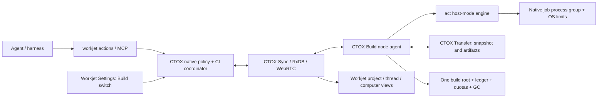

# Workjet Actions: distributed native CI

Status: S1 architecture proposal, 2026-10-10. This document defines the
implementation contract; it does not claim an installed service or successful
workflow execution. The supervisor reviews S1 before S2 starts and owns merges.

## Binding decisions and terminology

Workjet Actions is Workjet's GitHub-Actions-compatible distributed CI.
Earlier briefs call the same system "Build-Service" or "Workjet CI".
The 2026-10-10 Workjet Actions naming/compatibility decision takes precedence,
followed by the Workjet CI approval, the RxDB/locality clarification, and
storage rules A–G. No storage default is relaxed here.

An agent chooses what to build/test: an existing workflow, named job, selected
job/step, or ad-hoc run steps. Workjet Actions owns where and how it runs,
including source capture, placement, native execution, limits, logs, artifact
return and cleanup. All such execution uses the act Rust engine in host mode.
There is no separate unrestricted command executor.

A **node** is an assigned Workjet computer with the Build switch enabled.
A **run** is one immutable source/workflow/profile/request identity.
A **job** is a scheduled workflow job or expanded matrix member.
A **step** is an act step within a job.
A **snapshot** is an immutable content-addressed source copy.
A **lease** is a fenced, expiring execution/cache/storage reservation.
A **receipt** records observed execution and cleanup; it is not a PR approval.

## Existing implementation and integration boundaries

The source baseline inspected for S1 is main
`4de4d4f664adef4f07138d2b2dddafbad8811e0b`.
The separately preserved act donor is
[`e215ae179b9e6de10fea369c84f170e7916c2c1f`](https://github.com/metric-space-ai/ctox/tree/e215ae179b9e6de10fea369c84f170e7916c2c1f/src/tools/actions-runner).
It contains workflow, expression, runner, host/container, artifact and cache
modules, but is not connected to productive CTOX execution. Module presence
and upstream coverage comments do not prove host-mode workflow compatibility;
S2 must inventory and test the actual callable engine.

Reuse these existing components rather than create competing registries:

| Component | Existing source/document | Role and remaining work |
| --- | --- | --- |
| Computer identity, assignment and typed Build capability | `src/core/business_os/computer_capabilities.rs`, `computer_endpoints.rs` | Opaque owner-bound identities; existing slots/jobs/lane/toolchains are migration inputs. Automatic discovery replaces per-host manual profiles. |
| Durable build records | [native build jobs](../native-build-jobs.md), [job store](../native-build-job-store.md) | Existing authenticated Cargo recipes and revision/generation-fenced SQLite claims; extend to CI runs and steps, not a second LLM queue. |
| Frozen source and publication | [source intake](../native-build-source.md), [delivery](../native-build-delivery.md), [worker source](../native-worker-source.md) | Exact dirty bytes, modes, deletions and links; adapt to admitted CTOX Transfer and snapshot leases. |
| Native lane execution | [lane runner](../native-build-lane-runner.md), [SSH](../native-build-ssh.md) | Existing detached deadlines, slot locks and receipts; donor/migration code, not the permanent SSH management plane. |
| Transfer | `src/core/transfers/`, admitted worktree-copy work in ctox #541 | Incremental content transport using current peer, project and destination authority. Transfer owner: thread `01a0e259`. |
| Sync, commands and policy | [CTOX Sync](../ctox-rxdb.md), [harness](../../HARNESS.md) | Replicated management collections, native policy and current execution fences. |
| Installer cache retention | [cache retention](../build-cache-retention.md) | Donor retention/lease logic; its soft cap explicitly does not prevent disk exhaustion and cannot satisfy Workjet Actions by itself. |

The old instruction reference `docs/architecture.md` is absent at this
baseline. This proposal uses the current README, HARNESS and subsystem
documents above; it does not silently rely on that missing document.

## Architecture



CTOX supervises one build-agent component per enabled computer as part of its
existing daemon lifecycle. It does not install another per-host script/service.
The coordinator is the project's owning CTOX instance. Native policy owns
admission, fairness, allocation, quotas and eviction. RxDB synchronizes every
management record below; browsers and harnesses never allocate resources.

Only native service writers can publish execution state. A node owns its
observations/receipts; the coordinator owns queue order and assignments.
Replication master/fork selection or last-write-wins does not grant execution
leadership. There is one active coordinator epoch per owner. Coordinator
failover requires the existing native execution-authority mechanism to be
attached and proven, not merely another peer receiving a replica. Until then,
loss of the owner queues new work without starting a second scheduler.

## Interface: familiar workflow and run operations

The canonical public CLI is `workjet actions`. `ctox ci` is the native
backend/automation alias with identical request and result contracts.
The earlier `ctox build run` spelling is a migration alias, not another queue.

```sh
workjet actions list --project <project> --src <worktree>
workjet actions run --project <project> --task <stable-task> --src <worktree> -W .github/workflows/ci.yml
workjet actions run --project <project> --task <stable-task> --src <worktree> -W .github/workflows/ci.yml -j <job> --matrix os:linux --input key=value
workjet actions run --project <project> --task <stable-task> --src <worktree> --profile-job build
workjet actions run --project <project> --task <stable-task> --src <worktree> -W .github/workflows/ci.yml -j <job> --step <step-id>
workjet actions run --project <project> --task <stable-task> --src <worktree> -- cargo test --locked --jobs 2
workjet actions status <run>
workjet actions logs <run> --job <job> --step <step-id> --cursor <cursor> --follow
workjet actions cancel <run>
workjet actions explain <run>
workjet actions how --json
workjet actions quota --project <project>
workjet actions artifacts <run> --output <authorized-directory>
```

`list` lists workflows/profile jobs; `list --runs` lists owner/project runs.
Use stable YAML job/step IDs, not ambiguous display names. A selected job retains
its required `needs` closure; a selected step retains prerequisite steps by
default. Skipping prerequisites must be explicit, is recorded, and cannot pass
a full-workflow PR gate. Matrix filtering restricts declared combinations;
unknown jobs, inputs, step IDs and matrix values are typed errors.

Ad-hoc argv is preserved exactly and turned into a synthetic act `run:` step.
Multiple custom steps may be supplied through a validated YAML request file.
No caller string is interpolated into a transport command. Explicit shell
commands still run inside the same native job boundary and budgets.

`--computer auto|<name-or-id>` constrains eligible nodes; a name must resolve
uniquely to an authorized opaque ID. It cannot override policy or capacities.
`--wait-seconds` defaults to 30, accepts 0–1200, and never extends a harness
turn implicitly. At the bound the run remains durable and the reply identifies
how to resume observation. The CLI distinguishes child exit status from
queued/observation timeout; an unknown remote exit is never success.

MCP tools are `workjet_actions_list`, `workjet_actions_run`,
`workjet_actions_status`, `workjet_actions_logs`,
`workjet_actions_cancel`, `workjet_actions_explain`,
`workjet_actions_how`, `workjet_actions_quota` and
`workjet_actions_artifacts`. All accept/return the same versioned typed
contracts as the CLI; actor/owner/thread authority comes from the authenticated
session, not tool arguments. Tools call CTOX policy, never SQLite from a worker.

## Project CI definition and GitHub compatibility

Existing `.github/workflows/*.yml` files are the workflow source, unchanged
when host-compatible. A small optional `.workjet/actions.yml` maps friendly
agent job names to those files and declares resource/toolchain/cache needs.
Absence of a profile does not prevent workflow or ad-hoc runs: typed defaults
and actual node toolchains apply. The profile cannot grant permissions or
weaken storage limits. Example (illustrative workflow/job IDs):

```yaml
version: 1
defaults:
  resources: standard
  cache:
    profile: debug
    dependency_lockfiles: [Cargo.lock]
  retention:
    artifacts_days: 7
    logs_days: 14
jobs:
  build:
    workflow: .github/workflows/ci.yml
    job: build
    toolchains: ["rust:stable"]
  test:
    workflow: .github/workflows/ci.yml
    job: test
    resources: large
  lint:
    workflow: .github/workflows/ci.yml
    job: lint
  release:
    workflow: .github/workflows/release.yml
    resources: large
    cache:
      profile: release
```

Profile schema: `version:1`; `defaults` and each `jobs.<name>` accept
`resources` (class plus optional CPU/RAM/GPU requirements),
`toolchains` (native version constraints), `cache` (profile and lockfile
paths), `retention`, and `timeout_seconds`. A job selects a workflow and
optional job/step/matrix/input filters, or a list of normal `run:` steps.
Unknown fields and conflicting selectors fail validation. Resource overrides
remain bounded by current native policy; retention/quota changes require the
authorized Workjet setting and a measured reason, not a workflow override.
The resolved profile, actual toolchain fingerprints and workflow bytes are
hashed into the immutable run admission.

Compatibility targets include `on/jobs/steps/needs/strategy.matrix/env/defaults`,
`if/outputs/concurrency`, expressions with
`github/env/matrix/needs/steps/runner/inputs/secrets`, normal `run:`,
JavaScript `uses:` actions and composite actions. The engine must retain
dependencies, matrix expansion, failure/always conditions, outputs, timeouts,
pre/post steps and cleanup semantics. Concurrency groups are durable,
owner/repository scoped; `cancel-in-progress` cancels the old native run
through its normal stop path, not by killing the CTOX daemon.

### Abweichung von GitHub Actions

This table is also the future short skill's compatibility section.
It is a target contract, not a declaration that the donor already passes it.

| Difference | Workjet Actions behavior | Reason / agent action |
| --- | --- | --- |
| A. No Docker | Reject `container:`, `services:`, Docker actions and nested Docker/Podman/VM/emulator execution with `unsupported_container`. Engine container paths are inaccessible from this service. | Run native tools on a suitable node; do not silently drop these workflow requirements. |
| B. `runs-on` | Map `ubuntu-*` to compatible Linux nodes, `macos-*` to Macs, `windows-*` to Windows; additional labels select GPU/CUDA/Metal/platform capabilities. | No fresh GitHub VM/image. Record actual OS, distribution, architecture, Git and toolchain versions; an exact image/version requirement that cannot be met is a visible incompatibility. |
| C. Checkout | `actions/checkout` materializes the admitted snapshot in the job directory, preserving dirty/deleted/untracked captured bytes. It never replaces them with a fetched HEAD. | Record synthetic event context and actual commit/snapshot identity. Explicit checkout of a different repository/ref is a distinct, authorized source input or a typed unsupported request. |
| D. Cache/artifacts | `actions/cache`, upload/download-artifact use the act-compatible servers backed by the native ledger, project namespace, quotas and retention below. Warm caches stay on the node. | GitHub cache keys/restore prefixes are inner keys; they cannot escape the repo/toolchain/profile namespace or extend retention. Cross-node copies use CTOX Transfer. |
| E. Triggers | Agent starts are `workflow_dispatch`-like; push/PR scheduling is optional Workjet automation. | No implied GitHub webhook, hosted runner or GitHub token. `github` context distinguishes an explicit event from a synthesized one. |
| F. Secrets | Resolve just the authorized secrets from CTOX SecretStore at execution, mask before storage/streaming, never replicate raw secrets. | No automatic GitHub secret/token inheritance; fork/untrusted jobs receive no secrets. |
| G. Explanation | `status/explain/how/quota` report placement, queue, transfers, resource use and cleanup. | These observations supplement logs and results. Unknown ETA/progress is null, not invented. |
| H. Host setup privileges | Reject `sudo`, system package mutation and writes outside the build root; never pretend a rejected setup step succeeded. | An existing workflow containing privileged host setup is not host-compatible as written. Report the exact step; use present native prerequisites or a reviewed host-compatible workflow change. |

Native `actions/setup-node`, Rust toolchain actions (including
`dtolnay/rust-toolchain`), JavaScript actions and composites must be proven
against real pinned action versions. Setup uses already present compatible
toolchains, or an authorized native install into the build root under the
same budget; it never modifies system packages or the service user's real home.
Action acquisition/version resolution, native Node runtime availability and
post hooks are explicit S2/S9 compatibility cases. Unsupported action runtime,
missing event context, absent service or OS mismatch is reported before a
misleading green result. Existing unsupported donor seams must be listed by
S2 from code/tests; line count is not evidence of compatibility.

The upstream [GitHub workflow syntax](https://docs.github.com/en/actions/reference/workflows-and-actions/workflow-syntax)
is the syntax reference; [act runner documentation](https://nektosact.com/usage/runners.html)
is the host-runner reference. Compatibility is proved by execution, not inferred
from either reference. At the inspected CTOX head, `.github/workflows/ci.yml`
contains pinned checkout/setup-node/rust-toolchain actions, matrix jobs and
Linux `sudo apt-get` setup steps. These are concrete corpus cases: the latter
cannot run unchanged under H. Its draft-PR conditions also require a real or
explicitly synthesized event context; skipped jobs cannot produce a green
required-workflow gate. S2 must inventory all such unsupported steps before
S9 acceptance, without stripping or silently weakening them.

## Build switch: one action to first run

1. Owner enables **Build** in Settings → Computers. The existing authenticated
   command path binds the setting to the assigned computer and canonical owner.
   Default use is all eligible threads/projects of that owner; foreign tenants
   require an explicit native sharing grant, never a browser label.
2. CTOX on that computer starts its supervised agent component automatically.
   It probes logical cores, physical/available RAM, GPUs/VRAM, native toolchain
   binaries/versions, OS/architecture, mounts, available bytes/inodes, and
   enforceable native resource/path/write limits. Probes are bounded and their
   actual results are published in RxDB.
3. It selects one build root on an eligible large local disk. Exclude network
   mounts and unsafe/unwritable paths; prefer a suitable non-OS disk, then
   measured native I/O performance, usable capacity and stable volume identity.
   The OS disk is a fallback only when no other disk is suitable and all reserve
   rules still hold. Do not hard-code gpu3, SSD paths, SSH IPs or toolchain paths.
   A small bounded I/O probe is itself ledger-accounted.
4. Create the six directories below, initialize the local ledger/journal and
   derive budgets automatically. The computer publishes enabled/discovering/
   ready/draining/unavailable, measured limits and an actionable reason.
   Missing enforcement makes it unavailable for the affected class; enabling
   Build never installs Docker, requests root or asks for a host-specific script.
5. Establish the existing authenticated CTOX Sync connection and register
   toolchains/capacity/heartbeat. The coordinator verifies current assignment,
   owner/device binding, agent generation and policy before considering it.
6. A run submitted from any harness enters the durable queue. An eligible local
   Build node is preferred; otherwise choose a warm compatible node, then load.
   Acquire real reservations before starting, return the placement explanation,
   snapshot the worktree, execute, return artifacts/results and clean up.

Turning Build off drains existing leases, prevents new allocations, then stops
the owned component. Explicit cancel uses the normal job stop path. Restart
reconciles journal, live process groups and reservations before declaring slots
free. A disconnected node accepts no new or renewed assignments; the last
valid execution lease bounds already running work. Root removal/remount or
capacity reduction stops admission rather than falling back to the real home.

## Replicated management model

Proposed contract fixture:
`src/core/rxdb/tests/fixtures/workjet-actions-v1.json`.
Follow the existing fixture/generator/schema-hash pipeline in
[CTOX Sync §7](../ctox-rxdb.md#7-contracts-pipeline); generate Rust and browser
consumers together, never hand-edit generated files. These new versioned
collections avoid changing a deployed computer schema in place. Associate
Build state with the existing opaque `workjet_computers` identity.

All records have `id, owner_user_id, schema_version, revision, created_at_ms,
updated_at_ms` and native writer provenance. Node-scoped records also have
`computer_id, agent_generation`; execution records carry `run_id` and,
where relevant, `job_id, attempt, coordinator_epoch`. Times are UTC
milliseconds, sizes are integer bytes, unknown observations are null.
Secrets and usable lease/credential tokens never enter a replicated record.

Contract fixtures also pin field types, enums, payload bounds, writer/reader
policy and indexes. Unique keys are node identity, (run, YAML job, matrix,
attempt), (job, step, stage), (job, log sequence), (node, project, relative path),
(node, project, snapshot hash), (node, project) quota and (node, slot) active
lease. Owner/project/thread and run/job/cursor indexes support bounded keyset
reads. A schema or epoch mismatch disables scheduling, not permissions.

| Collection | Principal fields beyond the common envelope | Authorized native writer |
| --- | --- | --- |
| `workjet_actions_nodes` | enabled, state, labels, OS/architecture, cores, RAM, GPU inventory, actual toolchains/fingerprints, slots, limits, root/volume identity, heartbeat, capability failures | Node observation; owner policy for enablement |
| `workjet_actions_volumes` | volume_id, root-relative mount association, capacity/available/allocated bytes, free inodes, node_budget_bytes, reserve_bytes, accounting_backend, high/low watermarks, observed_at | Bound node |
| `workjet_actions_requests` | initiating thread/workspace, project/repository, task/idempotency key, requested workflow/profile/job/step/matrix/inputs or ad-hoc steps, source declaration, request_hash | Authenticated native intake |
| `workjet_actions_runs` | admission_hash, HEAD/snapshot/workflow/profile hashes, state, selected nodes, cancel_requested, timestamps, required job set, result/receipt refs | Coordinator |
| `workjet_actions_jobs` | YAML job ID, matrix identity, needs, resource class/actual allocation, toolchain fingerprints, cache_key, reservation, attempt, state, current step, exit/reason | Coordinator plus fenced node observations |
| `workjet_actions_steps` | step_id/order, pre/main/post stage, condition, state, outputs with redaction, timestamps/duration, exit/signal/error, log cursors | Executing bound node |
| `workjet_actions_queue` | project/role priority, fair-service counters, enqueue time, eligibility reason, queue position, estimated wait/confidence, concurrency group | Coordinator |
| `workjet_actions_leases` | kind (slot/cache/source/storage), holder run/job, node/slot/entry, generation, issued/expiry, reserved bytes/CPU/RAM, fencing_digest, state | Coordinator intent; node acknowledgement |
| `workjet_actions_log_chunks` | job/step/sequence, cursor range, compressed redacted payload, content_hash, head/tail/truncated counters, expires_at | Bound node; demand-loaded |
| `workjet_actions_receipts` | immutable admission/attempt binding, per-step results, real exit/signal, start/end/duration, log/artifact hashes, resource peaks, allocated/freed bytes, cleanup errors/pending refs | Bound node; coordinator verifies |
| `workjet_actions_ledger` | relative_path, kind (snapshot/worktree/cache/artifact/tmp/log/toolchain/metadata/orphan), project, repo/cache/snapshot identity, logical/allocated bytes, created/last_used/expiry, lease_refs, PR/release pins, first_seen, delete state | Node under native storage policy |
| `workjet_actions_quotas` | project/node, fraction/limit, used/reserved bytes by kind, over_quota, policy revision, measured override reason | Coordinator policy; node usage |
| `workjet_actions_gc_runs` | trigger, policy hash, candidates/protected entries, removed bytes/counts by project/kind, before/after usage, errors, start/end, next_due | Node |
| `workjet_actions_decisions` | run/job, candidate IDs, eligibility rejections, locality/cache/load inputs, chosen node, budget estimate, reason codes/text, observation timestamps | Coordinator |
| `workjet_actions_policy` | approved default classes/limits, retention, project quota overrides, coordinator epoch, harness enforcement/capability versions | Native owner policy |

Canonical policy/admission and fenced state persist through the native store
APIs; an outbox publishes every management field above into native RxDB.
The existing build-job store is in `runtime/business-os.sqlite3`; command
inbox/lifecycle/outbox ownership remains as specified in HARNESS in
`runtime/ctox.sqlite3`. Reuse these owners with explicit domain receipts and
idempotent reconciliation; do not claim transactions across those WALs.
Replicated views are durable management state and observations, not permits:
the target node revalidates current native authority before accepting effects.

Browser collection writes to jobs, queue, leases, quotas, logs, receipts and
ledger are denied. Enablement/submission/cancel/settings use immutable command
intent and native policy. Node-to-coordinator messages and management replication
use the authenticated CTOX Sync/RxDB WebRTC path. No HTTP business-data fallback,
new ad-hoc SSH fleet or cloud queue is introduced. The act artifact/cache HTTP
protocol is an isolated loopback job compatibility shim into the same ledger;
it is not a browser/peer data bridge, not exposed on the LAN, and cannot fetch
Business OS collections. Its job-scoped credentials expire with the lease.

Use demand-loading for logs and large records, bounded cursors and retention/
tombstones; do not eagerly copy every log to every browser. Reconnect retains
chunk identity/hash and cannot duplicate a job or fabricate completion.

## Planner, admission and fairness

Choose queued work before choosing its computer, so locality does not defeat
fairness. Use per-owner project queues, weighted deficit round robin with
equal project weights by default. P0/P1/P2 roles use weights 4/2/1 and FIFO
within an equal class; wait aging promotes one class after each 10 minutes
without resetting age after a capacity rejection. This preserves urgent work
while bounding starvation for jobs that fit a node. Do not preempt running
builds solely for another project's arrival.

For each eligible job:

1. Filter assigned, enabled, fresh nodes by current owner/project grant,
   workflow `runs-on`, OS/architecture, native toolchain fingerprint, GPU class,
   resource/path/write enforcement and concurrency eligibility.
2. Require an actually reservable slot, CPU/RAM/GPU allowance, source-copy
   allowance, exclusive cache writer lease and byte/inode budget. An advertised
   free slot is not itself a lease. Missing/stale observations exclude a node.
3. Prefer the initiating harness computer if it is an eligible Build node.
   That avoids network source transport but still uses an immutable snapshot,
   its own writable job copy, quota, limits and full bookkeeping.
4. Otherwise prefer a verified warm cache for the exact project's cache
   namespace; then lowest allocated capacity fraction (maximum of CPU, RAM,
   slots and storage), shortest predicted completion, and opaque ID as stable
   tie-breaker. A warm cache never overrides insufficient budget or fairness.
5. Persist the measured candidate decision. The coordinator offers a fenced
   allocation; the target rechecks real capacity and commits slot/storage/cache
   reservations together in its local journal before acknowledging. Only the
   acknowledged lease can start. Rejection queues or selects another candidate
   with the same job identity, without an unbounded retry loop.

Heartbeat/sample defaults: 5 seconds, stale after 30 seconds; execution lease
60 seconds, renew every 15 seconds. Local monotonic deadlines bound effects;
wall-clock timestamps remain observations. Expiry/revocation stops the entire
job group. Old generation acknowledgements, logs or exits cannot change a new
attempt. Reconcile an old attempt's actual process/exit before any relaunch;
uncertain execution remains `reconciling` and consumes capacity.

Queue positions/ETA are scoped to compatible candidates. ETA uses observed
durations for that workflow/cache key and reports null/low confidence without
history. Every wait returns a reason such as `slots_busy`, `cache_writer_busy`,
`disk_reserve`, `project_quota`, `toolchain_missing`, `node_stale` or
`enforcement_unavailable`, with allowed next actions. Suggested class changes
must still satisfy the workflow; never advise bypassing the service.

## Exact worktree copy and end-to-end run

A run proceeds through `accepted → queued → preparing → running → collecting
→ cleaning → succeeded|failed|cancelled`; a crash may add `reconciling`.
Step failure remains failure even if cleanup succeeds. Cleanup failure is
separately visible and cannot erase the real compiler exit.

1. Native intake authenticates the project/thread/workspace and freezes the
   request. A stable idempotency key with identical admission returns the
   original run; changed intent conflicts. Agent retries do not create duplicates.
2. Capture Git-tracked files, including tracked ignored files, plus nonignored
   untracked files, local edits, deletions, executable modes and literal links.
   Include explicitly declared generated inputs only through source policy.
   Exclude credentials, hooks, real home state, dependency caches and targets.
   The caller's workspace must be quiescent or use an actual snapshot barrier;
   a double scan alone is not a proof of a point-in-time snapshot. Concurrent
   mutation returns `source_changed`; never build a guessed mixed tree.
3. Compute an ordered manifest/hash from bytes, relative paths, types/modes/
   links/deletions and admitted Git metadata. Transport through the existing
   admitted Transfer/worktree-copy path sends only missing content and verifies
   hashes/modes before atomic publication. Public anonymous Git bases are an
   optimization; private sources do not copy Git credentials. Unsupported
   submodules/LFS materialization must be explicit, not silently omitted.
4. Store one immutable source copy per
   `(node, project, snapshot_content_hash)`. Concurrent arrival of the same
   snapshot coalesces under a publication lease. Each node may hold its local
   replica; it never creates duplicate copies of that snapshot on that node.
5. Create a private writable job directory by native copy/reflink from the
   snapshot. Never use writable hard links into it. Restore only sanitized
   Git metadata needed by admitted host actions; `actions/checkout` preserves
   this frozen tree. Local placement uses the same path without a network copy.
6. Acquire/restore compatible caches; install redirected paths and native
   resource/path/write limits; reset inherited ignored signal dispositions.
   Run the admitted workflow/step via act's host executor under the service
   UID, with actual node-native binaries.
7. Stream redacted step logs and observed metrics over Sync. Hash requested
   artifacts, publish their ledger entries and transfer them to an authorized
   caller destination. Cancellation and artifact return recheck live authority.
8. Stop/reap the whole group, finish post actions, persist the exit/receipt and
   release cache writers only after mutation stops. Delete the job worktree
   and temp immediately, retain eligible snapshot/cache/artifact/log entries,
   run GC and report freed/remaining bytes and future expiry times.

Disconnect does not lose the run. Agent journal and coordinator use CAS,
generation and immutable hashes to reconcile lost acknowledgements. A missing
exit/stop witness is not success or cancellation completion.

## Native execution and one writable build root (rules A–B)

Exactly one measured build root per node:

```text
<root>/
  worktrees/snapshots/<project>/<snapshot-hash>/
  worktrees/jobs/<run>/<job>/<attempt>/
  caches/<project>/<cache-key>/
  artifacts/<project>/<run>/
  tmp/<run>/<job>/
  logs/<project>/<run>/
  ledger/
```

Every allocation is registered before writing: relative path, kind, project,
allocated/logical bytes, creation/last-use times and lease. Contents are charged
to their entry; nested independently retained entries also have explicit rows.
Ledger databases/WALs, partial uploads, dependency/toolchain caches, logs,
archives and GC journals count toward the same budget. Keep bounded metadata
space reserved so even a full job allowance can record failure and cleanup.

Only the service-owned root is writable for jobs. Set a synthetic per-job HOME
inside `tmp` without changing CTOX's actual HOME. Redirect TMPDIR/TMP/TEMP,
XDG caches and language paths below. Read-only native toolchains/system libraries
are allowed; runtime databases, secrets, other projects and real home are not
job storage. Path enforcement must cover absolute paths, symlink escapes,
nested compilers, subprocesses and custom output flags, not just env defaults.

| Platform | Native process/resource control | Required evidence |
| --- | --- | --- |
| Linux | One cgroup v2 per job via user scope/delegation: CPU weight/quota, MemoryMax, MemorySwapMax=0, TasksMax; process-tree kill and native filesystem policy | Actual kernel limits, descendant containment, OOM classification and no outside-root writes |
| macOS | Owned process group, inherited RLIMITs, aggregate RSS/CPU/write watchdog and path policy | Actual aggregate monitoring, descendant stop and unsupported-limit diagnostics; RLIMIT alone is not a cgroup-equivalent aggregate RAM ceiling |
| Windows | Job Objects with kill-on-close, memory/CPU/process caps and native path/write policy | No breakaway descendants, full cancellation and enforced quotas |

No Docker/Podman/VM/emulator execution, privileged/root helpers, system package
updates or nested uncontrolled build runner. Resource limiting does not make
host execution an untrusted-code sandbox. Native read/write/process guards
must deny access to CTOX authority/secrets; unknown or untrusted fork code is
not admitted with the service UID until that boundary is proven.

Automatic CPU/RAM defaults (proposed, not measured overrides): reserve
max(2 GiB, 25% physical RAM), use at most 75% logical CPU capacity, derive
1–3 slots from available resource classes. Per-job maximum is 6 CPU workers,
40 GiB RAM, swap 0 and 512 processes, always reduced by actual available
capacity. Mac default is one job with at most two compiler workers, preserving
the current shared-host policy. Class defaults are small (1 CPU, 2 GiB,
8 GiB write allowance), standard (2 CPU, 8 GiB, 32 GiB), large (up to 6 CPU,
up to 40 GiB, 64 GiB). GPU jobs declare actual API/device/VRAM needs; no GPU is
invented from a hostname, and missing enforceable capacity queues the job.
Default execution timeout is 60 minutes, policy maximum 24 hours; terminate
then kill the entire group after a 10-second grace. Queue wait is separate.

### Cache/path redirection by language

These are generated execution settings, not new ambient runtime configuration
toggles. Persistent policy/configuration stays in typed CTOX settings.

| Family | Redirect under the root | Cache correctness / native toolchain |
| --- | --- | --- |
| Rust | CARGO_TARGET_DIR, CARGO_HOME registry/git, TMPDIR | Actual rustc/cargo/target/profile/features fingerprint; Cargo.lock for dependency cache; preserve CTOX prep where required; incremental compiler state remains disabled until its measured benefit/budget is approved |
| Node / Bun | npm cache, pnpm store, Corepack cache, Bun cache/install and job-local node_modules | Actual Node/Bun/package-manager versions, lockfiles, OS/ABI; no install in real HOME |
| C / C++ | CMake build dir, Ninja/Make output, ccache directory, TMPDIR | Compiler/linker/target/build flags and profile; generated files remain job-local |
| Python | pip/uv/wheel caches, job-local venv, pycache prefix, TMPDIR | Interpreter/ABI and lock/requirements hash; no user/global site installation |
| Swift / Xcode | SwiftPM caches, .build, DerivedData, module cache, TMPDIR | Actual Xcode/SDK/Swift/target and build configuration; signing secrets use current scoped native authority |

## Storage budgets, retention and GC (rules C–G)

The following storage defaults are Michael's specified values, unchanged.
GB/MB are decimal; GiB in resource classes is binary.

| Rule | Default |
| --- | --- |
| C: source snapshots | 24 hours after last use, at most 5 per project per node; evict oldest unleased snapshot first |
| C: job worktree and temp | Remove immediately after the job's process tree/post steps stop |
| D: cache namespace | Repository + actual toolchain version + profile; dependency caches also bind lockfile hash |
| D: project quota | 15% of the node's build budget, owner-adjustable in Workjet with measured reason |
| D: pressure eviction | At 70% of build-root budget, evict down to 60%; over-quota projects first, then global LRU |
| E: artifacts | Expire after 7 days; no expiry while a verified open PR or release references/pins them |
| E: logs | Compressed, expire after 14 days, at most 50 MB per job with retained head/tail and explicit truncation |
| F: node root budget | At most 70% of selected disk capacity |
| F: physical reserve | max(50 GB, 10% of disk capacity); also preserve the original no-disk-over-85% goal |
| G: GC triggers | After each job, every 15 minutes, immediately at budget pressure or disk free below reserve + 10% of disk capacity |
| G: orphan grace | First seen unledgered path waits 1 hour, only inside the verified build root |
| G: deletion eligibility | No active execution/cache/source/storage lease; no active PR/release artifact pin |

Let C be disk capacity, O measured allocated bytes outside this root, U allocated
root bytes, R=max(50 GB, 0.10*C). The automatically derived node budget is:

```text
B = max(0, min(0.70*C, 0.85*C - O, C - O - R))
```

Thus the 70% node-budget ceiling, physical reserve and 85% whole-disk ceiling
all apply together. Recalculate when outside use/capacity changes; B=0 means
unschedulable, not fallback to another unmanaged path. The GC high/low marks
are 0.70*B and 0.60*B, not 70%/60% of the disk. For an otherwise empty decimal
1 TB disk: B=700 GB, project quota=105 GB, GC starts at 490 GB and targets
420 GB; the reserve is 100 GB, and the pressure threshold for free disk is
200 GB. An OS disk lacking 50 GB reserve cannot become a Build node.

Admission reserves the job's maximum writable allowance as well as transfer,
source materialization, artifacts, logs and metadata. Existing allocated
bytes plus outstanding *remaining* reservations plus the new allowance must
fit B, current available disk minus R, the 85% ceiling, project quota and
available inodes. Do not double-count already allocated reservation bytes.
Estimate demand from p95 of the latest 20 completed same-key jobs plus 25%
headroom, never less than declared materialization size; otherwise use the
standard class. The estimate is displayed and frozen as an enforced job
allowance. A larger allowance is a new policy-checked reservation, not an
unchecked environment override. If it does not fit, GC may reclaim eligible
data, the planner may choose another node, or the job waits with a reason.

During execution, track aggregate writes/allocated bytes and stop the group
with `write_budget_exceeded` before it can consume another entry's reservation.
Keep failure/journal space outside the job allowance but inside B.
An admission check or directory-size polling alone **cannot** prove "never
ENOSPC"; cgroups/RLIMIT_FSIZE are not aggregate filesystem quotas. S5 must
deliver and prove a native write-accounting/enforcement backend on each enabled
platform, covering mmap/preallocation, sparse/CoW allocation, open-deleted files,
dependency/toolchain caches and all descendants. Native filesystem/project
quotas may be used when already available to the service account. No root,
virtualized execution, manual host script or silently weaker fallback is
permitted. A backend that cannot establish a bound publishes
`write_limit_unavailable` and is not production-ready for that class.
The concrete automatic native enforcement mechanism is an S5 engineering
question; this architecture does not disguise monitoring as a hard guarantee.
Unmanaged external writers can invalidate any free-space promise: detect the
changed volume observation, stop admission and contain managed jobs; never
delete outside data to restore the reserve.

### Shared caches without cross-checkout poisoning

Cache key is the rule-D namespace plus actual OS/ABI/target/compiler flags;
action-provided key/version/restore prefixes are scoped inside it. Repo IDs are
native authenticated identities, not caller-chosen strings. Never share writes
across repos, toolchains, profiles or trust domains.

One writer lease per key, with read-only parallel readers or budgeted private
copies. Publish a verified cache generation atomically only after its writer
stops. A subsequent agent of the same project can reuse that generation.
Keep job source/output directories distinct. Cargo targets from two checkouts
must not be made "fresh" by copying older mtimes: compare source content
manifests, invalidate changed compiler/build-script/generated inputs and prove
the old-mtime/two-checkout cases. If freshness cannot be proven, use a cold
compiler target while retaining compatible dependency/content-addressed caches.
Locking alone does not solve stale artifacts. Branch-family preferences may
be a profile choice; they are not an extra incompatible mandatory cache key.

Project quota charges snapshots, caches, worktrees, temp, artifacts/logs and
their reservations, with breakdowns shown in Workjet. Over-quota projects lose
eligible cache entries first. Pinned artifacts, active leases and uncertain
live jobs remain protected even under pressure; exhaustion queues/rejects new
jobs with `quota_pinned`, it does not break pins or erase evidence.
If all five source snapshots are leased, a sixth distinct snapshot waits
instead of violating the limit. TTL expiry makes an entry eligible; active
leases delay deletion and are visible as the reason.

GC owns one local lease per root. It selects expired unleased entries, excess
old snapshots, over-quota caches, then global LRU caches until 0.60*B or no
eligible candidate remains. Pressure never authorizes early deletion of an
unexpired log or pinned artifact. Record unresolved pressure explicitly.
Update last_used only on verified reuse; source cap ordering uses oldest
retained snapshots, cache ordering uses least-recent verified use.

Use root/volume identity, directory-relative no-follow operations and deletion
tombstones. Reject symlink/mount escape, corrupt ledger, uncertain ownership or
live/unreconciled process references. Unknown paths become observed orphans
with first_seen; after one hour and verified absence of live references they
may be removed only inside this exclusively owned root. Ledger writes, deletion
and byte reconciliation are restartable: a lost reply cannot double-count freed
space. GC receipt records requested/actual freed bytes per kind/project,
protected entries, errors, before/after budgets and next scheduled cleanup.

## Explainable to the agent at every stage

Every CLI/MCP reply/event includes contract version, run/job identity, state,
node ID/name when known, observed_at, reason codes, retryability and next action.
The same information is replicated and shown per project/thread/computer.

| Stage/tool | Required information |
| --- | --- |
| Start / queued | Candidate/selected node and why; required toolchains/CPU/RAM/GPU, locality/cache/load/budget observations, real free/total slots, queue position, ETA/confidence, cache warm/cold/unknown |
| Preparing | Snapshot identity, files/bytes total and missing, transfer bytes/progress, incremental/reused/local copy, destination ledger references |
| Running / status | Current job/step/stage, completed/total steps, actual CPU/RSS/peak/write bytes versus allowances, elapsed/time remaining, live log cursor; no invented percent for an opaque command |
| End | Per-step result and exit/signal, duration, actual cache/source/artifact/log bytes, freed bytes, cleanup pending/errors, authorized artifact paths/transfer hashes, expiry/pins, future cleanup |
| explain | Original and subsequent planner decisions, excluded candidates/reasons, frozen input observations, rerouting and budget estimates |
| how | Human-readable rules and versioned JSON capabilities/defaults/unsupported features, available languages/commands, paths/retention and enforcement limits |
| quota | Own project's per-node used/reserved bytes by kind, limit, reclaimable/pinned/leased bytes, upcoming expiry/GC and over-quota reason |

Logs are redacted before compression, RxDB publication, hash/export and live
streaming. The 50 MB limit bounds both retained uncompressed logical content
and compressed storage; keep head and rolling tail, count dropped bytes, drain
child output continuously so log truncation cannot deadlock a process. Small
chunk payloads (maximum 64 KiB before compression) use monotonic cursors.
Cancellation returns requested/stopping until a real group-stop witness; an
acknowledgement alone does not free a slot.

## Harness rule, short skill and technical enforcement

Ship one short **Workjet Actions** skill: "Like GitHub Actions, except A–G".
Use the compatibility table above, four CLI examples (Rust, Node/Bun, C++,
Python), language path/toolchain notes including Swift/Xcode, and common
errors with next actions. Language-family recipes are concise referenced
sections, not seven different CI systems. Coordinate existing role-prompt/
tool adapters with Harness owner `01a0fd85` before S8 integration.

Illustrative short-skill examples (POSIX commands; use the project's real
workflow/setup and declared native toolchains, rather than copying an unsuitable
language recipe):

```sh
# Rust
workjet actions run --project <project> --task check --src . -- cargo check --locked --jobs 2
# Node / Bun
workjet actions run --project <project> --task test --src . -- bash -c 'bun install --frozen-lockfile && bun test'
# C / C++
workjet actions run --project <project> --task test --src . -- bash -c 'cmake -S . -B build && cmake --build build --parallel 2 && ctest --test-dir build'
# Python: dependencies/venv setup belong in the project workflow or earlier steps
workjet actions run --project <project> --task test --src . -- python -m pytest
```

The ad-hoc forms become act host-mode run steps with the same budgets. Existing
workflow/profile jobs remain the preferred way to reuse dependency setup.
For Swift/Xcode, select a Mac toolchain/SDK profile and run its existing workflow;
DerivedData and signing follow the native rules above. Waiting returns a durable
run ID to inspect, OOM calls for a fitting class/worker count, quota pressure
reports reclaimable versus pinned bytes, and unsupported features point to the
compatibility difference; none of these errors grants a local bypass.

The shared role-prompt sentence is:

> Where you would otherwise use GitHub Actions (or local builds), use Workjet
> Actions; follow the differences in the “Workjet Actions” skill.

All builds, executable tests, dependency builds/installs, artifact-producing
commands and benchmarks go through Actions, including small tests. The newer
single-path decision supersedes the earlier local-single-test exception.
Only noncompiling formatting/syntax/read-only static checks may stay local,
bounded to 30 seconds, one CPU worker, 1 GiB RSS and 50 MB temporary writes,
without dependencies/model loads. A compiler, test execution or resource
overrun routes to Actions. Format edits to the agent's source remain editing;
the service never rewrites the caller's worktree.

Prompt text and PATH wrappers are guidance, not the security boundary.
Managed harness command launchers require native classification/admission
before spawn. Detect cargo/rustc, npm/pnpm/Bun build/install/test scripts,
cmake/ninja/make, gradle, Python tests/builds and xcodebuild/swift build/test,
including absolute executables, shell nesting and indirect package scripts.
Unclassifiable heavy execution is rejected with the Actions invocation, not
allowed because a command string escaped a regex. Inside an actual admitted
job, nested compilers are permitted within that native job's limits; the
exemption is a private process/lease binding, never a forgeable env marker.
Managed launch refuses an unsupported/unregistered enforcement adapter.
Unmanaged user terminals are outside this managed-agent claim.

| Harness | Prompt/tool delivery | Technical integration to prove with Harness owner |
| --- | --- | --- |
| Codex | Existing role base-instruction and dynamic-tool contracts | Native exec/shell handler gate; standalone managed launcher equivalent |
| Claude Code | Managed role instructions, skill and MCP registration | Managed command hook/launcher gate covering shell tools |
| Grok Build | Its actual registered harness adapter, same skill/tools | Gate the actual native command executor; provider name alone is not a harness |
| OpenCode | Managed role instructions and tool registration | Terminal/exec adapter gate and process binding |
| Pi | Existing CTOX sidecar prompt/tool composition | Shell-tool middleware plus native sidecar process gate |
| MiniMax Code | Actual managed harness adapter and role extensions | Native shell/exec gate; do not confuse model routing with enforcement |
| Greppy | Existing prompt/agent tool integration | Gate agent commands and bash-smart execution when used by managed threads |

Keep existing role restrictions: Reviewer/Planner read-only profiles can
observe authorized runs/quotas, but cannot gain run/cancel/setting authority
from the shared prompt. Worker tools retain current actor/project/session and
durable execution fences; explicit empty dynamic-tool lists stay empty.
Enforcement tests must cover restored sessions and quit/reopen, not only new
harness launches. No provider/vendor CLI installer or fabricated model ID is
needed for this integration.

## PR gate and migration from the prototype

A PR gate may require a successful **complete required workflow job set on the
final head**. The receipt binds repository, exact HEAD, snapshot, workflow/
profile hashes, actual toolchains, engine version, OS and policy. A dirty run is
useful development evidence but cannot certify a clean final head. Selected
step/job, ad-hoc, skipped prerequisite or partial matrix results are explicitly
partial and cannot satisfy a larger gate. Preserve required checks and normal
GitHub branch protection; do not fabricate a GitHub check, use admin merge or
publish secrets. Integration with GitHub checks is a separate authorized
publisher; local receipts do not automatically satisfy an existing GitHub rule.

Keep `gpu-build-run.sh` and `dev-heavy-run.py` operational until equivalence.
Do not install/reconfigure gpu3/gpu1/gpu4 before S1 review.

1. Preserve/integrate the act donor on its own reviewed S2 PR; test host mode.
2. Implement service contracts/node/planner/transport/limits/storage behind
   current typed capability readiness; no replacement based on unit tests alone.
3. Pilot on an isolated service-owned gpu3 root with real Molecularity and
   greppy workflow/worktree inputs. Do not adopt arbitrary legacy targets,
   databases, THESEN/customer data or another task's artifacts.
4. Compare prototype and Actions on the same exact source and command/workflow,
   cold/warm transfers and caches, contention, interruption, disk pressure,
   memory overflow, timeout and reconnect. Record versions, counts, exits,
   hashes, median/p95 elapsed/transfer times and allocated bytes. Acceptance
   target: warm overhead/throughput no worse than 10% beyond the measured
   prototype baseline, with a reasoned measurement if this cannot be met.
5. Make the scripts thin request/observation adapters into Actions. Map stable
   owner/task/src/computer options; `--target-key` cannot bypass native cache
   identities. Preserve actual child exit, 124 timeout, 137/OOM classification
   and queued/75 semantics, receipts and maximum 20-minute lane observation.
   During coexistence a shared admission namespace prevents duplicate capacity.
6. Retire prototype scheduling/GC only after installed native execution,
   fairness, limits, persistence, source exactness and cleanup equivalence.
   Rollback changes the routing adapter; never run both executors for one job.
   macOS-only packaging remains locally placed through the managed service.

Carry prototype findings into permanent tests: separate Cargo targets and
old-mtime/include/build-script freshness, SIGHUP/SIGINT/SIGQUIT reset after
detached launch, Git 2.34.1 behavior versus actual node versions, disk floors
and ENOSPC pressure, incomplete/no-log launch, OOM exit137, and bounded queue
waits that do not consume the harness turn limit. No rootful Podman repair,
unbounded rsync/script fallback or silently changing test commands.

## Slices and acceptance evidence

Each implementation slice is one reviewable PR, at most 70 minutes per turn,
first WIP commit within 25 minutes. If a package exceeds that bound, checkpoint
a coherent WIP PR and resume it; do not hide unpushed work or skip a guard.
Linux Rust verification remains on the existing GPU lane; waiting is capped
at 20 minutes, then preserve "build unverified". Claude owns merges.
S1 ends with this PR for review; S2 onward need no new principle approval after
that review. The following order incorporates the latest delivery instruction.

| Slice | Deliverable | Acceptance that must be recorded |
| --- | --- | --- |
| S1 | This Workjet Actions architecture | Latest brief precedence, profile/API/collections, rules A–G, compatibility table and acceptance coverage are reviewable; doc checks pass. No runtime claim. |
| S2 | Act engine in CTOX, host mode only | Required workspace check/test commands pass on final head in GPU lane; real native run/JS/composite/action fixtures, current API inventory and typed unsupported-container errors; attribution/licences retained. |
| S3 | Automatic node agent, generated RxDB contracts, planner | One Build switch → capacity/toolchains/root/budgets/ready without host script; two projects/nodes prove fairness, local→warm→load order, current lease fencing and Sync reconnection; management writes/foreign actors denied. |
| S4 | Admitted incremental worktree/artifact transfer | Dirty/untracked/deleted/mode/link exactness, concurrent mutation rejection, same-snapshot coalescing, local no-network copy, lost-ACK resume, safe artifact return and revoked-peer denial. |
| S5 | Native execution, language cache paths and enforced budgets | Linux scope limits, macOS/Windows boundaries as implemented, whole-group cancellation, no outside-root writes/secrets, warm cache plus old-mtime correctness, aggregate write bound rather than polling-only claim. |
| S6 | Ledger, quotas, TTL/LRU/FIFO and automatic GC | Every rule C–G including pinned/leased protection, crashes/orphans/escapes, real byte reconciliation and GC receipts; full A–G matrix below before production replacement. |
| S7 | CLI/MCP, explanations, Workjet visibility | All three run types and list/status/logs/cancel/explain/how/quota/artifact return share contracts; decisions/queue/transfer/metrics/cleanup render from real RxDB state and survive restart. |
| S8 | Short skill + all harness prompt/tool/gate adapters | Actual seven harness adapters including restored sessions use Actions, absolute/nested heavy command attempts cannot bypass; role permissions retained; exact language examples work. |
| S9 | Pilot, workflow compatibility and script replacement | Installed gpu3 Molecularity/greppy plus workjet/ctox workflow corpus, prototype equivalence receipts, at least one second node/local placement, clean final-head PR gate, wrappers and rollback without duplicate jobs. |

### Tests proving rules A–G and the complete user workflow

These are required future tests/evidence, not tests run by this documentation PR.

| Rule / requirement | Positive and negative proof |
| --- | --- |
| A: native only | Host run/JS/composite succeeds; container/services/Docker/nested virtualization rejected before execution; inspect native process and OS limits, no container daemon dependence. |
| B: one root | Auto disk choice prefers suitable non-OS disk; all language caches/tmp/targets/metadata ledgered; malicious output env/absolute/symlink path denied; root/mount replacement never falls back to home. |
| C: snapshots/jobs | Two jobs share one immutable hash copy with separate writable workdirs; dirty bytes/modes/deletions survive; job dirs disappear after stop; fake clock at 24 h and sixth-snapshot cap prove expiry/cap/active-lease protection. |
| D: cache | Same repo/toolchain/profile warm reuse by different agents; incompatible repos/toolchains/profiles/lockfiles do not share; two writers excluded; old mtimes cannot yield foreign binary; 15% quota and 70%→60% LRU order measured across projects. |
| E: artifacts/logs | Fake clock proves 7/14-day TTL; open-PR/release pin survives pressure until valid unpin; 50 MB log head/tail/truncation, compression/redaction and continued pipe drain; forbidden artifact path rejected. |
| F: storage/resource safety | Reserve/budget formula boundaries and concurrent reservations; tiny quota filesystem with rapid/mmap/sparse/unlinked writes and nested subprocesses produces budget error without physical ENOSPC; CPU/RAM/process/timeout overflow is contained and observed. |
| G: GC | Job completion/15-minute/pressure triggers; no leased or pinned deletion; orphan not deleted at 59 min and eligible at 60; external/symlink/mount targets untouched; crash before/after deletion reconciles bytes once and publishes per-project/kind receipt. |
| One switch / locality | Real Settings toggle → auto registration and first job; no manual profile/SSH setup; local eligible node first, incompatible local skipped, warm node then lower load; queue fairness/starvation and no duplicate allocations after disconnect. |
| RxDB / authority | Both generated sides/hash registries match fixtures; Workjet sees node/queue/jobs/steps/logs/receipts/quotas/GC; forged/foreign/revoked writers denied; no HTTP management bridge; restart preserves state and old lease cannot relaunch. |
| Explainability | Observed node/reason, actual queue/ETA confidence, transfer counts/cache status, step metrics/log cursors, exit/storage/cleanup and artifact TTL are available through CLI, MCP and Workjet; unknown data stays null. |
| Harnesses / PR gate | Each named harness launches through the gate after new/restored session; nested/absolute commands fail outside admission; dirty or partial run cannot certify a final-head required-workflow gate. |
| Compatibility corpus | Pin actual workjet `ci.yml`, greppy, ctox and Molecularity workflow revisions and action versions; run unchanged host-compatible cases, report each documented A–G difference/unsupported feature; enumerate all required jobs, not just executed passing subsets. |

Use isolated tenant/test roots and existing evidence storage. Tests, a merged
PR or an installed version alone do not prove the distributed product works.
File failures and their actual environment as well as successes; do not treat
recording failures as product failures.

## Questions to resolve through implementation evidence

The rules and product direction above are decided. The remaining engineering
questions do not authorize alternative containers, local bypasses or manual
host provisioning:

- Which native per-platform aggregate write boundary can be installed/selected
  automatically without root while meeting F? Prove it in S5, including raw
  writes and process escape; report unsupported capabilities honestly.
- Which host-runner and action APIs in the preserved act port are incomplete?
  Establish the S2 inventory and real repository corpus before claiming parity.
- Which existing native execution-authority attachment is ready for coordinator
  failover? Keep one owner coordinator until it is actually integrated.
- Which real hook/launcher enforces each external harness? Resolve with
  `01a0fd85` during S8; prompts/wrappers alone do not count as enforcement.

No storage-number deviation is proposed. Any later change requires measured
evidence and a reason in this document before replacing the stated defaults.

