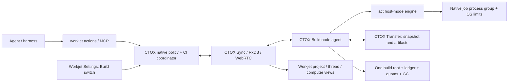

# Workjet Actions: distributed native CI

Status: S1 architecture proposal, 2026-10-10. This document defines the
implementation contract; it does not claim an installed service or successful
workflow execution. The supervisor reviews S1 before S2 starts and owns merges.

## Binding decisions and terminology

Workjet Actions is Workjet's GitHub-Actions-compatible distributed CI.
Earlier briefs call the same system "Build-Service" or "Workjet CI".
The 2026-10-10 Workjet Actions naming/compatibility decision takes precedence,
followed by the Workjet CI approval, the RxDB/locality clarification, and
storage rules A–G. No storage default is relaxed here.

An agent chooses what to build/test: an existing workflow, named job, selected
job/step, or ad-hoc run steps. Workjet Actions owns where and how it runs,
including source capture, placement, native execution, limits, logs, artifact
return and cleanup. All such execution uses the act Rust engine in host mode.
There is no separate unrestricted command executor.

A **node** is an assigned Workjet computer with the Build switch enabled.
A **run** is one immutable source/workflow/profile/request identity.
A **job** is a scheduled workflow job or expanded matrix member.
A **step** is an act step within a job.
A **snapshot** is an immutable content-addressed source copy.
A **lease** is a fenced, expiring execution/cache/storage reservation.
A **receipt** records observed execution and cleanup; it is not a PR approval.

## Existing implementation and integration boundaries

The source baseline inspected for S1 is main
`4de4d4f664adef4f07138d2b2dddafbad8811e0b`.
The separately preserved act donor is
[`e215ae179b9e6de10fea369c84f170e7916c2c1f`](https://github.com/metric-space-ai/ctox/tree/e215ae179b9e6de10fea369c84f170e7916c2c1f/src/tools/actions-runner).
It contains workflow, expression, runner, host/container, artifact and cache
modules, but is not connected to productive CTOX execution. Module presence
and upstream coverage comments do not prove host-mode workflow compatibility;
S2 must inventory and test the actual callable engine.

Reuse these existing components rather than create competing registries:

| Component | Existing source/document | Role and remaining work |
| --- | --- | --- |
| Computer identity, assignment and typed Build capability | `src/core/business_os/computer_capabilities.rs`, `computer_endpoints.rs` | Opaque owner-bound identities; existing slots/jobs/lane/toolchains are migration inputs. Automatic discovery replaces per-host manual profiles. |
| Durable build records | [native build jobs](../native-build-jobs.md), [job store](../native-build-job-store.md) | Existing authenticated Cargo recipes and revision/generation-fenced SQLite claims; extend to CI runs and steps, not a second LLM queue. |
| Frozen source and publication | [source intake](../native-build-source.md), [delivery](../native-build-delivery.md), [worker source](../native-worker-source.md) | Exact dirty bytes, modes, deletions and links; adapt to admitted CTOX Transfer and snapshot leases. |
| Native lane execution | [lane runner](../native-build-lane-runner.md), [SSH](../native-build-ssh.md) | Existing detached deadlines, slot locks and receipts; donor/migration code, not the permanent SSH management plane. |
| Transfer | `src/core/transfers/`, admitted worktree-copy work in ctox #541 | Incremental content transport using current peer, project and destination authority. Transfer owner: thread `01a0e259`. |
| Sync, commands and policy | [CTOX Sync](../ctox-rxdb.md), [harness](../../HARNESS.md) | Replicated management collections, native policy and current execution fences. |
| Installer cache retention | [cache retention](../build-cache-retention.md) | Donor retention/lease logic; its soft cap explicitly does not prevent disk exhaustion and cannot satisfy Workjet Actions by itself. |

The old instruction reference `docs/architecture.md` is absent at this
baseline. This proposal uses the current README, HARNESS and subsystem
documents above; it does not silently rely on that missing document.

## Architecture



CTOX supervises one build-agent component per enabled computer as part of its
existing daemon lifecycle. It does not install another per-host script/service.
The coordinator is the project's owning CTOX instance. Native policy owns
admission, fairness, allocation, quotas and eviction. RxDB synchronizes every
management record below; browsers and harnesses never allocate resources.

Only native service writers can publish execution state. A node owns its
observations/receipts; the coordinator owns queue order and assignments.
Replication master/fork selection or last-write-wins does not grant execution
leadership. There is one active coordinator epoch per owner. Coordinator
failover requires the existing native execution-authority mechanism to be
attached and proven, not merely another peer receiving a replica. Until then,
loss of the owner queues new work without starting a second scheduler.

## Interface: familiar workflow and run operations

The canonical public CLI is `workjet actions`. `ctox ci` is the native
backend/automation alias with identical request and result contracts.
The earlier `ctox build run` spelling is a migration alias, not another queue.

```sh
workjet actions list --project <project> --src <worktree>
workjet actions run --project <project> --task <stable-task> --src <worktree> -W .github/workflows/ci.yml
workjet actions run --project <project> --task <stable-task> --src <worktree> -W .github/workflows/ci.yml -j <job> --matrix os:linux --input key=value
workjet actions run --project <project> --task <stable-task> --src <worktree> --profile-job build
workjet actions run --project <project> --task <stable-task> --src <worktree> -W .github/workflows/ci.yml -j <job> --step <step-id>
workjet actions run --project <project> --task <stable-task> --src <worktree> -- cargo test --locked --jobs 2
workjet actions status <run>
workjet actions logs <run> --job <job> --step <step-id> --cursor <cursor> --follow
workjet actions cancel <run>
workjet actions explain <run>
workjet actions how --json
workjet actions quota --project <project>
workjet actions artifacts <run> --output <authorized-directory>
```

`list` lists workflows/profile jobs; `list --runs` lists owner/project runs.
Use stable YAML job/step IDs, not ambiguous display names. A selected job retains
its required `needs` closure; a selected step retains prerequisite steps by
default. Skipping prerequisites must be explicit, is recorded, and cannot pass
a full-workflow PR gate. Matrix filtering restricts declared combinations;
unknown jobs, inputs, step IDs and matrix values are typed errors.

Ad-hoc argv is preserved exactly and turned into a synthetic act `run:` step.
Multiple custom steps may be supplied through a validated YAML request file.
No caller string is interpolated into a transport command. Explicit shell
commands still run inside the same native job boundary and budgets.

`--computer auto|<name-or-id>` constrains eligible nodes; a name must resolve
uniquely to an authorized opaque ID. It cannot override policy or capacities.
`--wait-seconds` defaults to 30, accepts 0–1200, and never extends a harness
turn implicitly. At the bound the run remains durable and the reply identifies
how to resume observation. The CLI distinguishes child exit status from
queued/observation timeout; an unknown remote exit is never success.

MCP tools are `workjet_actions_list`, `workjet_actions_run`,
`workjet_actions_status`, `workjet_actions_logs`,
`workjet_actions_cancel`, `workjet_actions_explain`,
`workjet_actions_how`, `workjet_actions_quota` and
`workjet_actions_artifacts`. All accept/return the same versioned typed
contracts as the CLI; actor/owner/thread authority comes from the authenticated
session, not tool arguments. Tools call CTOX policy, never SQLite from a worker.

