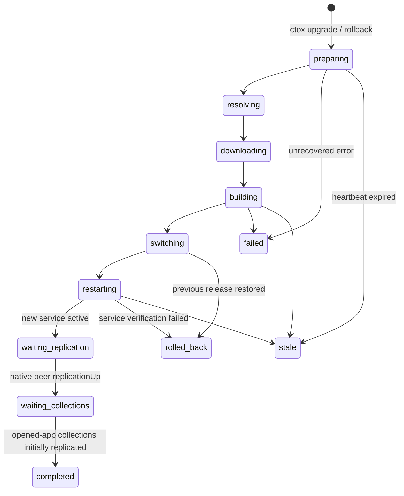

# Business OS Upgrade and Maintenance State

CTOX exposes one durable, instance-scoped maintenance lease while a managed
upgrade or rollback is running. The lease is control-plane state. It contains
release identifiers, phase, progress, liveness timestamps and readiness flags,
but never Business OS records or collection payloads.

The canonical record lives in the singleton `ctox_maintenance_state` table in
the state-root `ctox.sqlite3`. It is created before `ctox upgrade` resolves or
downloads a release, so a browser can distinguish an intentional restart from
lost or deleted data.

## State machine

`completed` is reached only after all three readiness gates are true:

1. the new CTOX service is active;
2. the native RxDB peer reports `replicationUp: true`;
3. the browser has observed initial replication for every non-demand-only
   collection required by the apps that are currently open.

The browser sends the third acknowledgement as the typed
`ctox.maintenance.client_ready` Business Command. It therefore travels through
the existing RxDB/WebRTC data plane and native policy/command router. There is
no HTTP data fallback. `GET /api/business-os/ctox/maintenance` is the only new
browser endpoint and returns actor-independent control-plane status.

## Shell behavior

While a lease is active, stale or failed, the shell displays the global message
“CTOX wird aktualisiert – Daten bleiben erhalten”. Existing local RxDB records
remain visible, but shell-delivered collection and Command Bus facades reject
mutations with `CTOX_MAINTENANCE_READ_ONLY`. Empty-state copy is suppressed and
replaced by “Daten werden nach dem Update synchronisiert” until replication is
complete.

The shell remembers the lease across the service restart. A temporary
connection failure therefore cannot make the maintenance UI disappear. Stale
and failed leases stay visible with retry guidance; a successful rollback
reports that the previous release was restored.

## Desktop recovery

Window geometry continues to use the scoped `desktop_windows` collection and a
local cache. Separately, the shell stores a small instance-and-user-scoped local
workspace snapshot containing open app owner IDs, minimized/maximized app mode,
the focused window and active full-screen module. This is shell UI state, not
Business data. It survives logout/login and static-shell replacement during an
upgrade, and is restored only after authentication, module catalog loading and
data-plane initialization.
