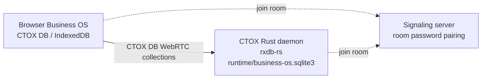

# CTOX Business OS

This document describes the architecture, data-flow, and operational commands of **Business OS**, the browser-based client surface for CTOX.

The Business OS is built as a native CTOX surface, served directly from the active CTOX daemon instance, rather than a separate external SaaS stack.

---

## 1. Runtime Shape

The application layers are distributed between the host daemon and the web client:

```text
CTOX App (Rust Daemon Host)
  -> Served from the active CTOX instance webserver
  -> SQLite Authoritative state (runtime/business-os.sqlite3)
  -> SQLite Core daemon database (runtime/ctox.sqlite3)
  -> SQLite RxDB sync metadata (runtime/business-os-rxdb.sqlite3)
  -> Rust native P2P sync peer (rxdb-rs)
  -> Command validation and agent loop supervision

CTOX Business OS Web App (Browser Client)
  -> Statically served HTML/JS/CSS (vanilla runtime)
  -> Local CTOX DB data store (browser IndexedDB)
  -> WebRTC P2P sync peer (ctox-rxdb-js)
```

To support setups behind NAT, residential firewalls, or private networks, the Business OS **does not require the CTOX instance to expose a public inbound IP address**. The client and daemon replicate collections peer-to-peer using WebRTC paired signaling rooms.

---

## 2. Sync Architecture (CTOX DB / RxDB WebRTC)

Replication between the client browser (IndexedDB) and the daemon (SQLite) is handled by the **CTOX DB WebRTC replication contract**. CTOX DB is the Business OS runtime id for the CTOX-owned RxDB-derived implementation; it is not a drop-in replacement for upstream npm `rxdb`.



1. **Signaling Pairing**: Both the browser client and the Rust daemon connect outbound to a configured signaling server (e.g. `wss://signaling.ctox.dev`, configured via `CTOX_BUSINESS_OS_SIGNALING_URLS` or persisted in `runtime/business-os-signaling-urls.json`) and join a deterministic pairing room (`ctox-business-os:...`) secured by a room password.
2. **P2P Channel**: Once paired, a direct WebRTC channel carries all data sync.
3. **Rust Core Authority**: The Rust daemon remains the authority for command execution and state-machine transitions. The browser writes command documents to RxDB; the daemon peer consumes, validates, and applies them to the authoritative SQLite database, and replicates the resulting projections back to the client.

### Strict WebRTC-Only Data Path Invariants

To preserve WebRTC-only sync invariants, all record-shaped data must flow exclusively via the WebRTC/RxDB synchronization layer. 
- **No HTTP Bridge or Fallbacks**: The system has no HTTP endpoints or data proxies for fetching or updating records. Obsolete references, such as the research module's legacy HTTP fallback endpoint for fetching parquet rows, have been completely removed.
- **Mesh Materialization**: In modules like systematic research and knowledge databases, the authoritative Rust peer materializes records (including tables imported from parquet catalogs) directly into synced collections such as `knowledge_tables`. If a document does not yet carry synced rows locally, the client UI surfaces nothing until P2P replication delivers the data over WebRTC.

---

## 3. JSON-Native Records

To keep local queries and synchronization fast, business modules define their data as JSON. Master records live in generic, replicated RxDB collections:

- **`business_definitions`**: Module schemas, prompts, display DSLs, and JSON validation contracts.
- **`business_records`**: Master data records. The actual document is held as generic JSON in `data`.
- **Derived Indices**: Fields like `index_text`, `sort_key`, `status_key`, and `score_key` are generated as lightweight index projections to optimize local client-side sorting and search filters.

---

## 4. Remote Browser Data Path

The Business OS Browser app is a remote-browser viewer, not an embedded browser. The CTOX host owns the actual Chromium process and the browser client only sees replicated state.

All Remote Browser traffic uses the existing RxDB/WebRTC collection replication path. The design explicitly does not add direct browser-to-runtime WebSockets, VNC, noVNC, WebRTC media streams, second signaling rooms, or public Playwright/CDP endpoints.

Durable, auditable lifecycle actions use `business_commands`:

- `browser.session.start`
- `browser.session.stop`
- `browser.navigate`
- `browser.reload`
- `browser.back`
- `browser.forward`
- `browser.reset`

The same command/projection pattern is used by the core Tickets app. Browser actions write `ctox.ticket.*` command documents into `business_commands`; CTOX executes the native ticket capability and republishes ticket state through `ctox_ticket_*` collections over the existing WebRTC data path.

High-churn browser data uses dedicated replicated collections:

- **`browser_sessions`**: Session ownership, lifecycle, current URL/title, viewport, health, and native runtime errors.
- **`browser_tabs`**: Tab-level URL/title/loading state and frame counters.
- **`browser_frames`**: Transient base64 frame payloads, dimensions, encoding, sequence, hash, and expiry.
- **`browser_input_events`**: Mouse, wheel, keyboard, and future text-input events with sequence numbers and native processing status.

Frame records are transient operational data. Native cleanup must enforce a per-session ringbuffer and `expires_at_ms` before a real Playwright runtime is allowed to publish continuous frames.

Remote Browser frame retention is intentionally bounded:

- The native runtime writes only through `browser_frames`; no app-facing frame stream bypasses RxDB.
- Every frame carries `expires_at_ms`.
- The native frame publisher and periodic cleanup keep only the newest 30 active frames per session and tombstone expired or older frame documents.
- Tombstones are expected replication artifacts. They are retained long enough for RxDB peers to observe deletes, and physical compaction is treated as a storage maintenance concern rather than part of the live stream path.
- The effective capture rate is derived from `browser_sessions`: active viewers run at 2-6 fps, idle sessions at 0.5-1 fps, and native backpressure can reduce capture when input backlog, frame write latency, or delayed viewer-heartbeat arrival grows. The configured target remains `frame_rate_target`; the applied runtime value is telemetry in `payload.effective_frame_rate_target`.

Remote Browser control is native-authorized:

- Browser command documents carry the Business OS actor in `client_context.actor`.
- Browser input events carry the actor in `payload.actor`.
- The native peer enforces a single-controller policy. A new session is owned by the actor that starts or first navigates it; subsequent commands and inputs must come from the session owner, current controller, or an admin/chef actor.
- Accepted lifecycle commands write non-secret audit metadata into `browser_sessions.payload.last_actor`, tab payloads, and command result fields. Frame documents remain transient visual data and do not carry credentials, session tokens, or Playwright/CDP endpoints.

---

## 5. Agent Communication: Business OS MCP

Business OS MCP is the supported agent communication channel for external software. It is separate from the browser replication path.

Use MCP for:

- status and module discovery
- bounded record and context queries
- run, artifact, and approval inspection
- proposing Business OS actions
- executing policy-gated actions
- approving, rejecting, or requesting changes on queued work

Do not use MCP as:

- shell access
- raw SQL access
- RxDB replication
- browser remote control
- an HTTP data proxy for Business OS collections

Managed channel shape:

```text
Agent -> https://mcp.ctox.dev/mcp/<instance-id> -> connected CTOX daemon -> Business OS policy/store
```

For `cto1.kunstmen.com`, Codex uses this MCP server entry:

```text
cto1-kunstmen-business-os
https://mcp.ctox.dev/mcp/cto1.kunstmen.com
```

The companion external-agent skill is stored at:

```text
skills/ctox-business-os-mcp/
```

The skill tells Codex or another agent how to use the typed MCP tools safely. It does not grant access by itself; access is granted only by the configured MCP server token and the CTOX Business OS MCP policy.

The managed gateway requires the CTOX daemon to hold an outbound WebSocket:

```sh
export CTOX_BUSINESS_OS_MCP_CONNECT_TOKEN=<instance-connect-token>
ctox business-os mcp connect \
  --url wss://mcp.ctox.dev/connect/cto1.kunstmen.com
```

If the instance is not connected, `/mcp/cto1.kunstmen.com` returns `runtime_unavailable` and agents must report that CTOX MCP is not connected.

---

## 6. Desktop Shell Infrastructure

The main entrypoint is the Desktop shell (`modules/desktop/`), providing a lightweight operating environment:

- **Cross-Cutting Services**: Shared OS infrastructure lives under `src/apps/business-os/shared/`:
  - `shared/window-manager.js`: Coordinates overlapping workbench workspaces.
  - `shared/notifications.js`: Surfaces live events from the daemon's command streams.
  - `shared/event-bus.js` & `shared/context-menu.js`: Facilitates inter-module communication.
- **Vanilla Runtime Policy**: Views are authored in direct HTML, CSS, and JS so that CTOX agents can patch and extend them dynamically without requiring an external build/transpilation step.
- **OS Chrome Styling**: The overall shell appearance can be toggled macOS-style or Windows-style via the `[data-shell-style="windows" | "macos"]` attribute on the `<body>` element. All UI elements resolve their tokens against `src/apps/business-os/app.css`.

---

## 7. Module Versioning and Rollback

Business OS supports strict module bundle versioning, automated integrity checks, and a granular rollback system. This replaces the old legacy single `module.json` manifest hashing with a comprehensive, whole-bundle file provenance capture.

### SQLite Versioning Schema

All version records are stored in the authoritative SQLite store (`runtime/business-os.sqlite3`) in the `business_module_versions` table:

```sql
CREATE TABLE IF NOT EXISTS business_module_versions (
    version_id TEXT PRIMARY KEY,
    module_id TEXT NOT NULL,
    seq INTEGER NOT NULL,
    origin TEXT NOT NULL,
    label TEXT NOT NULL DEFAULT '',
    bundle_sha256 TEXT NOT NULL,
    files_json TEXT NOT NULL DEFAULT '[]',
    sealed INTEGER NOT NULL DEFAULT 0,
    created_by TEXT NOT NULL DEFAULT '',
    created_at_ms INTEGER NOT NULL,
    updated_at_ms INTEGER NOT NULL
);
CREATE INDEX IF NOT EXISTS idx_business_module_versions_module
    ON business_module_versions(module_id, seq DESC);
```

#### Columns Explained:
- `version_id`: A unique, prefixed identifier for the version (e.g. `modver_{module_id}_{seq}_{uuid}`).
- `module_id`: The sanitized identifier slug of the business-os module.
- `seq`: Monotonically increasing sequence number per module.
- `origin`: The source origin type, including `install`, `manual_release`, `rollback`, `edit`, and `creator_deploy`.
- `bundle_sha256`: A SHA-256 checksum of the entire directory bundle.
- `files_json`: A JSON array storing the relative path and full text content of each source file included in the bundle baseline.
- `sealed`: A boolean integer (`0` or `1`) indicating whether the version boundary has been sealed. Edits coalesce into a single open (`sealed = 0`) working version, whereas actions like installations, rollbacks, and manual releases seal the boundary.
- `created_by` / `created_at_ms` / `updated_at_ms`: Metadata tracking user sessions and timestamps.

### RxDB Operational Commands

Rollback operations are driven through generic RxDB command documents published by the client browser peer into the replicated `business_commands` collection:

1. **`ctox.module.list_versions`**:
   - **Request Payload**:
     ```json
     {
       "module_id": "widget"
     }
     ```
   - **Response**: Returns a JSON summary listing of all registered versions under that module, sorted by sequence in descending order.

2. **`ctox.module.rollback_version`**:
   - **Request Payload**:
     ```json
     {
       "module_id": "widget",
       "version_id": "modver_widget_1_..."
     }
     ```
   - **Response**: Returns the status of the operation showing the number of restored and removed files:
     ```json
     {
       "ok": true,
       "module_id": "widget",
       "rolled_back_to": "modver_widget_1_...",
       "restored_files": 3,
       "removed_files": 1
     }
     ```

### Rollback Mechanics

When a rollback is triggered, the native daemon performs the following sequence to guarantee integrity and safety:
1. **Permission Check**: The active session is checked to verify modification rights for the specific module.
2. **File Restoration**: The baseline file mapping is parsed from the target version's `files_json` field. Each target file's relative path and content are restored on disk (overwriting current edits).
3. **Removal of Post-Baseline Files**: Files in the current working directory that did not exist in the baseline version are identified. Before removing them from disk, they are snapshot-buffered so that the deletion itself is fully reversible.
4. **Verification**: A whole-bundle checksum is recalculated and validated against the baseline's `bundle_sha256`.
5. **Sealing the Boundary**: A new sealed module version record is inserted with the origin `"rollback"`, recording the event in the history timeline.

### Front-End UI Modifications

1. **Visual Modification Badge**: The App Store card and details drawer render a visual modification status badge (`app-mod-state`) indicating whether a module is `Unverändert` (Clean - matching the baseline SHA-256) or `Modifiziert` (Modified - where the live bundle checksum diverges from the baseline).
2. **App-Class-Aware Timeline Dialog**: The App Store provides a detailed interactive timeline of versions. It tracks and translates version origins into German or English localization states, rendering files count, version sequences (`#seq`), dates, and sealing status (e.g. `Installiert: Release 1.0` or `Bearbeitung · offen`). A "Wiederherstellen" button prompts the user and dispatches the command.

---

## 8. Command Reference

Manage the Business OS instance directly from the CLI:

```sh
# Inspect the native and bundled Business OS assets
ctox business-os status

# Check pairing room credentials and synchronization status
ctox business-os peer status

# Rotate the WebRTC pairing room and signaling password
ctox business-os peer rotate

# Serve the Business OS app locally
ctox business-os serve [--addr 127.0.0.1:8765]

# Serve local Business OS MCP for development
ctox business-os mcp serve [--addr 127.0.0.1:8788]

# Connect this CTOX instance to the managed MCP gateway
CTOX_BUSINESS_OS_MCP_CONNECT_TOKEN=<token> \
  ctox business-os mcp connect --url wss://mcp.ctox.dev/connect/<instance-id>

# Install a standalone Business OS repository to an empty directory
ctox business-os install --target <empty-dir> [--init-git]

# List and manage optional skill-app modules
ctox business-os modules list
ctox business-os modules enable <module-name>
ctox business-os modules disable <module-name>

# List and manage packed skills
ctox business-os skills list
ctox business-os skills enable <skill-name>
ctox business-os skills disable <skill-name>
```
