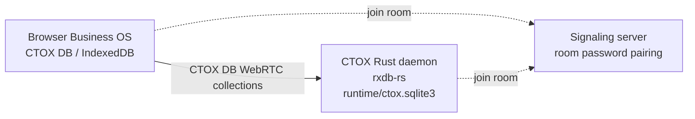

# CTOX Business OS

This document describes the architecture, data-flow, and operational commands of **Business OS**, the browser-based client surface for CTOX.

The Business OS is built as a native CTOX surface, served directly from the active CTOX daemon instance, rather than a separate external SaaS stack.

---

## 1. Runtime Shape

The application layers are distributed between the host daemon and the web client:

```text
CTOX App (Rust Daemon Host)
  -> Served from the active CTOX instance webserver
  -> SQLite authoritative state (runtime/ctox.sqlite3)
  -> Rust native P2P sync peer (rxdb-rs)
  -> Command validation and agent loop supervision

CTOX Business OS Web App (Browser Client)
  -> Statically served HTML/JS/CSS (vanilla runtime)
  -> Local CTOX DB data store (browser IndexedDB)
  -> WebRTC P2P sync peer (ctox-rxdb-js)
```

To support setups behind NAT, residential firewalls, or private networks, the Business OS **does not require the CTOX instance to expose a public inbound IP address**. The client and daemon replicate collections peer-to-peer using WebRTC paired signaling rooms.

---

## 2. Sync Architecture (CTOX DB / RxDB WebRTC)

Replication between the client browser (IndexedDB) and the daemon (SQLite) is
handled by the **CTOX DB WebRTC replication contract**. CTOX DB is the
Business OS runtime id for the CTOX-owned RxDB-derived implementation; it is
not a drop-in replacement for upstream npm `rxdb`.



1. **Signaling Pairing**: Both the browser client and the Rust daemon connect outbound to a configured signaling server (e.g. `wss://signaling.ctox.dev`) and join a deterministic pairing room (`ctox-business-os:...`) secured by a room password.
2. **P2P Channel**: Once paired, a direct WebRTC channel carries all data sync.
3. **Rust Core Authority**: The Rust daemon remains the authority for command execution and state-machine transitions. The browser writes command documents to RxDB; the daemon peer consumes, validates, and applies them to the authoritative SQLite database, and replicates the resulting projections back to the client.

---

## 3. JSON-Native Records

To keep local queries and synchronization fast, business modules define their data as JSON. Master records live in generic, replicated RxDB collections:

- **`business_definitions`**: Module schemas, prompts, display DSLs, and JSON validation contracts.
- **`business_records`**: Master data records. The actual document is held as generic JSON in `data`.
- **Derived Indices**: Fields like `index_text`, `sort_key`, `status_key`, and `score_key` are generated as lightweight index projections to optimize local client-side sorting and search filters.

---

## 4. Remote Browser Data Path

The Business OS Browser app is a remote-browser viewer, not an embedded browser. The CTOX host owns the actual Chromium process and the browser client only sees replicated state.

All Remote Browser traffic uses the existing RxDB/WebRTC collection replication path. The design explicitly does not add direct browser-to-runtime WebSockets, VNC, noVNC, WebRTC media streams, second signaling rooms, or public Playwright/CDP endpoints.

Durable, auditable lifecycle actions use `business_commands`:

- `browser.session.start`
- `browser.session.stop`
- `browser.navigate`
- `browser.reload`
- `browser.back`
- `browser.forward`
- `browser.reset`

The same command/projection pattern is used by the core Tickets app. Browser
actions write `ctox.ticket.*` command documents into `business_commands`; CTOX
executes the native ticket capability and republishes ticket state through
`ctox_ticket_*` collections over the existing WebRTC data path.

High-churn browser data uses dedicated replicated collections:

- **`browser_sessions`**: Session ownership, lifecycle, current URL/title, viewport, health, and native runtime errors.
- **`browser_tabs`**: Tab-level URL/title/loading state and frame counters.
- **`browser_frames`**: Transient base64 frame payloads, dimensions, encoding, sequence, hash, and expiry.
- **`browser_input_events`**: Mouse, wheel, keyboard, and future text-input events with sequence numbers and native processing status.

Frame records are transient operational data. Native cleanup must enforce a per-session ringbuffer and `expires_at_ms` before a real Playwright runtime is allowed to publish continuous frames.

Remote Browser frame retention is intentionally bounded:

- The native runtime writes only through `browser_frames`; no app-facing frame stream bypasses RxDB.
- Every frame carries `expires_at_ms`.
- The native frame publisher and periodic cleanup keep only the newest 30 active frames per session and tombstone expired or older frame documents.
- Tombstones are expected replication artifacts. They are retained long enough for RxDB peers to observe deletes, and physical compaction is treated as a storage maintenance concern rather than part of the live stream path.
- The effective capture rate is derived from `browser_sessions`: active viewers run at 2-6 fps, idle sessions at 0.5-1 fps, and native backpressure can reduce capture when input backlog, frame write latency, or delayed viewer-heartbeat arrival grows. The configured target remains `frame_rate_target`; the applied runtime value is telemetry in `payload.effective_frame_rate_target`.

Remote Browser control is native-authorized:

- Browser command documents carry the Business OS actor in `client_context.actor`.
- Browser input events carry the actor in `payload.actor`.
- The native peer enforces a single-controller policy. A new session is owned by the actor that starts or first navigates it; subsequent commands and inputs must come from the session owner, current controller, or an admin/chef actor.
- Accepted lifecycle commands write non-secret audit metadata into `browser_sessions.payload.last_actor`, tab payloads, and command result fields. Frame documents remain transient visual data and do not carry credentials, session tokens, or Playwright/CDP endpoints.

---

## 5. Agent Communication: Business OS MCP

Business OS MCP is the supported agent communication channel for external
software. It is separate from the browser replication path.

Use MCP for:

- status and module discovery
- bounded record and context queries
- run, artifact, and approval inspection
- proposing Business OS actions
- executing policy-gated actions
- approving, rejecting, or requesting changes on queued work

Do not use MCP as:

- shell access
- raw SQL access
- RxDB replication
- browser remote control
- an HTTP data proxy for Business OS collections

Managed channel shape:

```text
Agent -> https://mcp.ctox.dev/mcp/<instance-id> -> connected CTOX daemon -> Business OS policy/store
```

For `cto1.kunstmen.com`, Codex uses this MCP server entry:

```text
cto1-kunstmen-business-os
https://mcp.ctox.dev/mcp/cto1.kunstmen.com
```

The companion external-agent skill is stored at:

```text
skills/ctox-business-os-mcp/
```

The skill tells Codex or another agent how to use the typed MCP tools safely. It
does not grant access by itself; access is granted only by the configured MCP
server token and the CTOX Business OS MCP policy.

The managed gateway requires the CTOX daemon to hold an outbound WebSocket:

```sh
export CTOX_BUSINESS_OS_MCP_CONNECT_TOKEN=<instance-connect-token>
ctox business-os mcp connect \
  --url wss://mcp.ctox.dev/connect/cto1.kunstmen.com
```

If the instance is not connected, `/mcp/cto1.kunstmen.com` returns
`runtime_unavailable` and agents must report that CTOX MCP is not connected.

---

## 6. Desktop Shell Infrastructure

The main entrypoint is the Desktop shell (`modules/desktop/`), providing a lightweight operating environment:

- **Cross-Cutting Services**: Shared OS infrastructure lives under `src/apps/business-os/shared/`:
  - `shared/window-manager.js`: Coordinates overlapping workbench workspaces.
  - `shared/notifications.js`: Surfaces live events from the daemon's command streams.
  - `shared/event-bus.js` & `shared/context-menu.js`: Facilitates inter-module communication.
- **Vanilla Runtime Policy**: Views are authored in direct HTML, CSS, and JS so that CTOX agents can patch and extend them dynamically without requiring an external build/transpilation step.
- **OS Chrome Styling**: The overall shell appearance can be toggled macOS-style or Windows-style via the `[data-shell-style="windows" | "macos"]` attribute on the `<body>` element. All UI elements resolve their tokens against `src/apps/business-os/app.css`.

---

## 7. Command Reference

Manage the Business OS instance directly from the CLI:

```sh
# Inspect the native and bundled Business OS assets
ctox business-os status

# Check pairing room credentials and synchronization status
ctox business-os peer status

# Rotate the WebRTC pairing room and signaling password
ctox business-os peer rotate

# Serve the Business OS app locally
ctox business-os serve [--addr 127.0.0.1:8765]

# Serve local Business OS MCP for development
ctox business-os mcp serve [--addr 127.0.0.1:8788]

# Connect this CTOX instance to the managed MCP gateway
CTOX_BUSINESS_OS_MCP_CONNECT_TOKEN=<token> \
  ctox business-os mcp connect --url wss://mcp.ctox.dev/connect/<instance-id>

# Install a standalone Business OS repository to an empty directory
ctox business-os install --target <empty-dir> [--init-git]

# List and manage optional skill-app modules
ctox business-os modules list
ctox business-os modules enable <module-name>
ctox business-os modules disable <module-name>

# List and manage packed skills
ctox business-os skills list
ctox business-os skills enable <skill-name>
ctox business-os skills disable <skill-name>
```
