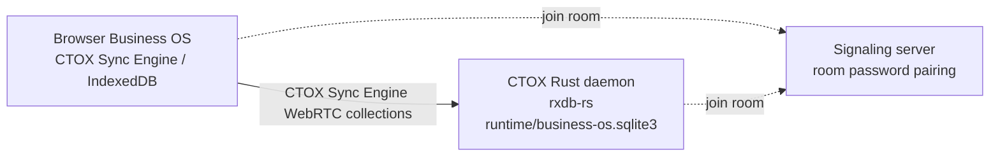

# CTOX Business OS

## Native research field writeback provenance

Research writebacks stamp each delivered company status and accepted person-bound
status with `revision: {writeback_id, command_id, attempt, written_at_ms}`.
`writeback_id` is the native writeback receipt ID, `command_id` the correlated
research command, and `attempt` the durable gap/research queue-task attempt.
A chat assignment without such a task records `null`, rather than fabricating
an attempt number.
Trusted local calls without an envelope ID receive a native-generated ID which
is returned with the writeback and persisted in the field revision.

Worker-supplied `revision` is replaced and worker-supplied `review` is removed.
The existing field evidence, person binding and native email verdict guards
still decide what is accepted. Partial writebacks retain untouched field
statuses; a replacement status expires its previous review. The contact view
copies the same revision from the canonical person status.

This is writeback provenance only. Revision-bound typed refutation, atomic
review publication and app field reopening remain separate required
integration work; a revision stamp alone does not prove review acceptance.

## Operator coding presets and daemon readiness

`ctox coding-agent models` reads the public `ctox.coding.models.v1`
document through the existing private service socket for the selected root.
It includes opaque preset IDs and `subscription_listener_ready`; it does not
return tokens or configure accounts. This inspection skips the short-lived
CLI database ledger. A present but unreachable, rejected or incompatible
daemon is an error, not permission to invent a local model route.

`ctox coding-agent turn --preset <id>` resolves that exact daemon-published
preset immediately before the existing bounded embedded-pi turn. The
daemon's process-local subscription readiness remains authoritative. An
offline root retains its existing local capability rules; no subscription
listener or account is synthesized. Business OS commands retain their native
policy checks and daemon-local resolver. The IPC addition reads metadata only:
it cannot forward an arbitrary turn, raw model, header or credential.

Use an actually advertised model ID. A Desktop worker label or missing static
catalogue entry does not establish account eligibility or provider availability.
This correction neither adds a GPT model alias nor selects a fallback provider.

For an identified root, use `ctox coding-agent models --root <root>` and
`ctox coding-agent turn --module <id> --prompt <text> --preset <id> --root <root>`.
The global root is selected by main. Coding handlers accept its one validated
argument pair without reselecting the root; missing or duplicate pairs and
unknown options fail. Only valid catalogue inspection skips the CLI ledger;
turns retain their existing lifecycle and policy checks.

## Queue instruction boundary

Native queue admission preserves the complete selected `payload.instruction`
or fallback `payload.prompt` up to 8,000 Unicode characters after trimming.
An instruction above that boundary returns
`business_command_instruction_too_large` before attachment materialization,
workspace creation or queue admission. The error includes only the size and
limit, never the instruction content. Queue retry-prompt reconstruction uses
the same boundary; it does not rebuild a shortened executable instruction.
The dedicated CV-print parsing prompt keeps its separate existing contract.

Callers must split larger requests into bounded commands or put structured
data in suitably bounded payload chunks. The JSON/context preview remains a
bounded preview; this instruction guard does not claim that every oversized
data payload is fully present in a worker prompt. Existing queued tasks and
production records are not rewritten by this change.

This document describes the architecture, data-flow, and operational commands of **Business OS**, the browser-based client surface for CTOX.

The Business OS is built as a native CTOX surface, served directly from the active CTOX daemon instance, rather than a separate external SaaS stack.

---

## 1. Runtime Shape

The application layers are distributed between the host daemon and the web client:

```text
CTOX App (Rust Daemon Host)
  -> Served from the active CTOX instance webserver
  -> SQLite Authoritative state (runtime/business-os.sqlite3)
  -> SQLite Core daemon database (runtime/ctox.sqlite3)
  -> SQLite RxDB sync metadata (runtime/business-os-rxdb.sqlite3)
  -> Rust native P2P sync peer (rxdb-rs)
  -> Command validation and agent loop supervision

CTOX Business OS Web App (Browser Client)
  -> Statically served HTML/JS/CSS (vanilla runtime)
  -> Local CTOX Sync Engine data store (browser IndexedDB)
  -> WebRTC P2P sync peer (ctox-rxdb-js)
```

To support setups behind NAT, residential firewalls, or private networks, the Business OS **does not require the CTOX instance to expose a public inbound IP address**. The client and daemon replicate collections peer-to-peer using WebRTC paired signaling rooms.

---

## 2. Sync Architecture (CTOX Sync Engine / RxDB WebRTC)

Replication between the client browser (IndexedDB) and the daemon (SQLite) is handled by the **CTOX Sync Engine WebRTC replication contract**. CTOX Sync Engine is the Business OS runtime id for the CTOX-owned RxDB-derived implementation; it is not a drop-in replacement for upstream npm `rxdb`.


```mermaid
flowchart LR
  Browser["Browser Business OS<br/>CTOX Sync Engine / IndexedDB"] -- "CTOX Sync Engine WebRTC collections" --> CTOX["CTOX Rust daemon<br/>rxdb-rs<br/>runtime/business-os.sqlite3"]
  Browser -. "join room" .-> Signaling["Signaling server<br/>room password pairing"]
  CTOX -. "join room" .-> Signaling
```

1. **Signaling Pairing**: Both the browser client and the Rust daemon connect outbound to a configured signaling server (e.g. `wss://signaling.ctox.dev`, configured durably in `runtime/business-os-signaling-urls.json`; `CTOX_BUSINESS_OS_SIGNALING_URLS` overrides it for the current process only and is never written back) and join a deterministic pairing room (`ctox-business-os:...`) secured by a room password.
2. **P2P Channel**: Once paired, a direct WebRTC channel carries all data sync.
3. **Rust Core Authority**: The Rust daemon remains the authority for command execution and state-machine transitions. The browser writes command documents to RxDB; the daemon peer consumes, validates, and applies them to the authoritative SQLite database, and replicates the resulting projections back to the client.

### Strict WebRTC-Only Data Path Invariants

To preserve WebRTC-only sync invariants, all record-shaped data must flow exclusively via the WebRTC/RxDB synchronization layer. 
- **No HTTP Bridge or Fallbacks**: The system has no HTTP endpoints or data proxies for fetching or updating records. Obsolete references, such as the research module's legacy HTTP fallback endpoint for fetching parquet rows, have been completely removed.
- **Mesh Materialization**: In modules like systematic research and knowledge databases, the authoritative Rust peer materializes records (including tables imported from parquet catalogs) directly into synced collections such as `knowledge_tables`. If a document does not yet carry synced rows locally, the client UI surfaces nothing until P2P replication delivers the data over WebRTC.

---

## 3. JSON-Native Records

To keep local queries and synchronization fast, business modules define their data as JSON. Master records live in generic, replicated RxDB collections:

- **`business_definitions`**: Module schemas, prompts, display DSLs, and JSON validation contracts.
- **`business_records`**: Master data records. The actual document is held as generic JSON in `data`.
- **Derived Indices**: Fields like `index_text`, `sort_key`, `status_key`, and `score_key` are generated as lightweight index projections to optimize local client-side sorting and search filters.

---

## 4. Remote Browser Data Path

The Business OS Browser app is a remote-browser viewer, not an embedded browser. The CTOX host owns the actual Chromium process and the browser client only sees replicated state.

All Remote Browser traffic uses the existing RxDB/WebRTC collection replication path. The design explicitly does not add direct browser-to-runtime WebSockets, VNC, noVNC, WebRTC media streams, second signaling rooms, or public Playwright/CDP endpoints.

Durable, auditable lifecycle actions use `business_commands`:

- `browser.session.start`
- `browser.session.stop`
- `browser.navigate`
- `browser.reload`
- `browser.back`
- `browser.forward`
- `browser.reset`

The same command/projection pattern is used by the core Tickets app. Browser actions write `ctox.ticket.*` command documents into `business_commands`; CTOX executes the native ticket capability and republishes ticket state through `ctox_ticket_*` collections over the existing WebRTC data path.

High-churn browser data uses dedicated replicated collections:

- **`browser_sessions`**: Session ownership, lifecycle, current URL/title, viewport, health, and native runtime errors.
- **`browser_tabs`**: Tab-level URL/title/loading state and frame counters.
- **`browser_frames`**: Transient base64 frame payloads, dimensions, encoding, sequence, hash, and expiry.
- **`browser_input_events`**: Mouse, wheel, keyboard, and future text-input events with sequence numbers and native processing status.

Frame records are transient operational data. Native cleanup must enforce a per-session ringbuffer and `expires_at_ms` before a real Playwright runtime is allowed to publish continuous frames.

Remote Browser frame retention is intentionally bounded:

- The native runtime writes only through `browser_frames`; no app-facing frame stream bypasses RxDB.
- Every frame carries `expires_at_ms`.
- The native frame publisher and periodic cleanup keep only the newest 30 active frames per session and tombstone expired or older frame documents.
- Tombstones are expected replication artifacts. They are retained long enough for RxDB peers to observe deletes, and physical compaction is treated as a storage maintenance concern rather than part of the live stream path.
- The effective capture rate is derived from `browser_sessions`: active viewers run at 2-6 fps, idle sessions at 0.5-1 fps, and native backpressure can reduce capture when input backlog, frame write latency, or delayed viewer-heartbeat arrival grows. The configured target remains `frame_rate_target`; the applied runtime value is telemetry in `payload.effective_frame_rate_target`.

Remote Browser control is native-authorized:

- Browser command documents carry the Business OS actor in `client_context.actor`.
- Browser input events carry the actor in `payload.actor`.
- The native peer enforces a single-controller policy. A new session is owned by the actor that starts or first navigates it; subsequent commands and inputs must come from the session owner, current controller, or an admin/chef actor.
- Accepted lifecycle commands write non-secret audit metadata into `browser_sessions.payload.last_actor`, tab payloads, and command result fields. Frame documents remain transient visual data and do not carry credentials, session tokens, or Playwright/CDP endpoints.

---

## 5. Agent Communication: Business OS MCP

Business OS MCP is the supported agent communication channel for external software. It is separate from the browser replication path.

Use MCP for:

- status and module discovery
- bounded record and context queries
- run, artifact, and approval inspection
- proposing Business OS actions
- executing policy-gated actions
- approving, rejecting, or requesting changes on queued work

Do not use MCP as:

- shell access
- raw SQL access
- RxDB replication
- browser remote control
- an HTTP data proxy for Business OS collections

Managed channel shape:

```text
Agent -> https://mcp.ctox.dev/mcp/<instance-id> -> connected CTOX daemon -> Business OS policy/store
```

For `cto1.example.com`, Codex uses this MCP server entry:

```text
cto1-example-business-os
https://mcp.ctox.dev/mcp/cto1.example.com
```

The companion external-agent skill is stored at:

```text
skills/ctox-business-os-mcp/
```

The skill tells Codex or another agent how to use the typed MCP tools safely. It does not grant access by itself; access is granted only by the configured MCP server token and the CTOX Business OS MCP policy.

`ctox start` starts the local Business OS MCP server by default on
`http://127.0.0.1:8788/mcp`, alongside the local Business OS web surface on
`http://127.0.0.1:8765`. This is the same-host agent path; keep it bound to
localhost unless the deployment has a separate network/auth plan. Install with
`--no-business-os-autostart` to keep both local surfaces disabled by default and
start them explicitly with the commands below.

Local MCP configuration is exposed to admins in Business OS Settings -> MCP and
through the no-store control-plane route `/api/business-os/mcp/connect-info`.
That payload includes the local endpoint, the local inbound bearer token, and
ready-to-copy MCP server snippets for agent clients. Managed `mcp.ctox.dev`
clients use a separate managed MCP client token from ctox.dev/Web Auth; the
local bearer token must not be reused as a managed gateway token. The same
payload includes a managed dashboard URL when the instance is not yet connected;
open `https://ctox.dev/dashboard?tenant=<instance-id>#mcp`, switch to **MCP**,
press **Token rotieren**, and copy the one-time token shown under **Neuer
Token**. If an operator provides ctox.dev email/password credentials, use those
only to authenticate to the control plane and rotate the MCP token; the agent
still connects with the resulting bearer token.

The managed gateway requires the CTOX daemon to hold an outbound WebSocket:

```sh
export CTOX_BUSINESS_OS_MCP_CONNECT_TOKEN=<instance-connect-token>
ctox business-os mcp connect \
  --url wss://mcp.ctox.dev/connect/cto1.example.com
```

If the instance is not connected, `/mcp/cto1.example.com` returns `runtime_unavailable` and agents must report that CTOX MCP is not connected.

For Business OS app development, MCP exposes typed app actions rather than raw
filesystem or SQL access. A coding agent that should edit source itself uses
`business_os.prepare_app_source`, `business_os.list_app_files`,
`business_os.read_app_file`, `business_os.search_app_source`, and
`business_os.write_app_file` inside the app-scoped
`runtime/business-os/installed-modules/<module_id>` source root. Browser ESM
dependencies are checked in as relative `.mjs` files such as `vendor/<name>.mjs`
or `lib/<name>.mjs`; MCP does not expose npm, shell, SQL, or raw RxDB fallback
paths. A successful `business_os.write_app_file` response includes the target
`app_directory`, file `sha256`, live module `asset_revision`, catalog revision
and fingerprint, and `live=true`. The agent validates with
`business_os.validate_app` and can run
`business_os.smoke_app` / `business_os.e2e_app` for browser behavior.

Module coding uses the existing action tools, not generic task delegation.
An authorized actor sees `ctox.coding.models` (`apps.view`) and
`ctox.coding.turn` (`apps.modify`) in `business_os.list_module_actions`.
Propose/execute `ctox.coding.models` with `payload: {}` for the exact module;
the execution response carries the durable native result in `coding_result`.
This avoids granting collection-wide command reads just to select a preset.
The existing daemon IPC dispatch owns both actions when its socket is present;
connection/protocol errors fail closed. Only an advertised opaque preset may
be selected. Propose/execute
`ctox.coding.turn` with `payload: {prompt, preset_id}`. Native admission binds
`module_id` from the action scope; conflicting module IDs, raw model/URL/header
objects, faux mode and record scope are rejected. The existing native handler
re-resolves the preset and runs one bounded embedded-pi leaf turn. No account,
listener, permission or source root is synthesized by this bridge.

Managed tokens still need the corresponding tool allowlist and module scope.
Source inspection separately requires `business_os.list_app_files` /
`business_os.read_app_file` and `apps.source.view` for that module. In the managed
MCP control plane, only the tenant Owner/Admin can issue a token via
`POST /api/instances/<tenant-id>/managed-mcp`. The existing
`issue_app_development_token` action supplies source tools but its fixed tool
list does not include the coding action tools. For this route, use the existing
`rotate_token` action with explicit scopes: `allowedModules: [module_id]`,
`allowedCollections: ["__ctox_no_access__"]`, reads/writes enabled, approvals and
external effects disabled, and only the needed metadata/source tools plus
`business_os.list_module_actions`, `business_os.propose_action`,
`business_os.execute_action`. Verify that the deployed control plane accepts,
retains and enforces `allowedModules` before issuing: an older schema may strip
that unknown field, producing an unrestricted module scope. Such deployments
need the module-scope control-plane update first. Keep a short expiry and revoke
after acceptance. The native actor separately needs the exact module app permissions; an assigned
Founder can hold these capabilities without a global Admin grant.
`allowedTools` rejection cannot be bypassed with the operator CLI
or by copying another runtime's credentials. Local CLI execution additionally
requires an actually prepared source root and its authorized native account;
a retained binary alone supplies neither.

`business_os.create_app` and `business_os.modify_app` remain delegated app-work
actions. They enqueue CTOX app work and return `command_id`, `task_id`,
`app_directory`, and a `development_contract` containing the source root,
required files, the `business-os-app-module-development` resources, and
validation/smoke/E2E
commands. Agents should still poll `business_os.get_command_status` whenever the
initial status is not terminal.

---

## 6. Desktop Shell Infrastructure

The main entrypoint is the Desktop shell (`modules/desktop/`), providing a lightweight operating environment:

The shell and built-in `modules/` tree always come from the active immutable
CTOX release. Durable extensions live only below
`runtime/business-os/installed-modules/` or
`runtime/business-os/local-modules/`. At native server start, legacy
state-root copies of the release-owned `modules/` tree are moved into
`runtime/business-os/.recovery/release-owned-system-module-overlays/`; they are
kept for recovery but can no longer override the active release.

- **Cross-Cutting Services**: Shared OS infrastructure lives under `src/apps/business-os/shared/`:
  - `shared/window-manager.js`: Coordinates overlapping workbench workspaces.
  - `shared/notifications.js`: Surfaces live events from the daemon's command streams.
  - `shared/event-bus.js` & `shared/context-menu.js`: Facilitates inter-module communication.
- **Decision Hub notifications**: Open `agent_escalation` decisions project into
  the existing durable owner-notification collection and are rendered as
  system notifications by the desktop shell. In Workjet Mobile the same shared
  service forwards only a bounded, redacted title/body and opaque decision
  identifiers to the native notification bridge. Decision context and option
  contents remain inside Business OS and continue to sync exclusively through
  RxDB/WebRTC.
- **Vanilla Runtime Policy**: Views are authored in direct HTML, CSS, and JS so that CTOX agents can patch and extend them dynamically without requiring an external build/transpilation step.
- **OS Chrome Styling**: The overall shell appearance can be toggled macOS-style or Windows-style via the `[data-shell-style="windows" | "macos"]` attribute on the `<body>` element. All UI elements resolve their tokens against `src/apps/business-os/app.css`.

---

## 7. Module Versioning and Rollback

Business OS supports strict module bundle versioning, automated integrity checks, and a granular rollback system. This replaces the old legacy single `module.json` manifest hashing with a comprehensive, whole-bundle file provenance capture.

### SQLite Versioning Schema

All version records are stored in the authoritative SQLite store (`runtime/business-os.sqlite3`) in the `business_module_versions` table:

```sql
CREATE TABLE IF NOT EXISTS business_module_versions (
    version_id TEXT PRIMARY KEY,
    module_id TEXT NOT NULL,
    seq INTEGER NOT NULL,
    origin TEXT NOT NULL,
    label TEXT NOT NULL DEFAULT '',
    bundle_sha256 TEXT NOT NULL,
    files_json TEXT NOT NULL DEFAULT '[]',
    sealed INTEGER NOT NULL DEFAULT 0,
    created_by TEXT NOT NULL DEFAULT '',
    created_at_ms INTEGER NOT NULL,
    updated_at_ms INTEGER NOT NULL
);
CREATE INDEX IF NOT EXISTS idx_business_module_versions_module
    ON business_module_versions(module_id, seq DESC);
```

#### Columns Explained:
- `version_id`: A unique, prefixed identifier for the version (e.g. `modver_{module_id}_{seq}_{uuid}`).
- `module_id`: The sanitized identifier slug of the business-os module.
- `seq`: Monotonically increasing sequence number per module.
- `origin`: The source origin type, including `install`, `manual_release`, `rollback`, `edit`, and `creator_deploy`.
- `bundle_sha256`: A SHA-256 checksum of the entire directory bundle.
- `files_json`: A JSON array storing the relative path and full text content of each source file included in the bundle baseline.
- `sealed`: A boolean integer (`0` or `1`) indicating whether the version boundary has been sealed. Edits coalesce into a single open (`sealed = 0`) working version, whereas actions like installations, rollbacks, and manual releases seal the boundary.
- `created_by` / `created_at_ms` / `updated_at_ms`: Metadata tracking user sessions and timestamps.

### RxDB Operational Commands

Rollback operations are driven through generic RxDB command documents published by the client browser peer into the replicated `business_commands` collection:

1. **`ctox.module.list_versions`**:
   - **Request Payload**:
     ```json
     {
       "module_id": "widget"
     }
     ```
   - **Response**: Returns a JSON summary listing of all registered versions under that module, sorted by sequence in descending order.

2. **`ctox.module.rollback_version`**:
   - **Request Payload**:
     ```json
     {
       "module_id": "widget",
       "version_id": "modver_widget_1_..."
     }
     ```
   - **Response**: Returns the status of the operation showing the number of restored and removed files:
     ```json
     {
       "ok": true,
       "module_id": "widget",
       "rolled_back_to": "modver_widget_1_...",
       "restored_files": 3,
       "removed_files": 1
     }
     ```

### Rollback Mechanics

When a rollback is triggered, the native daemon performs the following sequence to guarantee integrity and safety:
1. **Permission Check**: The active session is checked to verify modification rights for the specific module.
2. **File Restoration**: The baseline file mapping is parsed from the target version's `files_json` field. Each target file's relative path and content are restored on disk (overwriting current edits).
3. **Removal of Post-Baseline Files**: Files in the current working directory that did not exist in the baseline version are identified. Before removing them from disk, they are snapshot-buffered so that the deletion itself is fully reversible.
4. **Verification**: A whole-bundle checksum is recalculated and validated against the baseline's `bundle_sha256`.
5. **Sealing the Boundary**: A new sealed module version record is inserted with the origin `"rollback"`, recording the event in the history timeline.

### Front-End UI Modifications

1. **Visual Modification Badge**: The App Store card and details drawer render a visual modification status badge (`app-mod-state`) indicating whether a module is `Unverändert` (Clean - matching the baseline SHA-256) or `Modifiziert` (Modified - where the live bundle checksum diverges from the baseline).
2. **App-Class-Aware Timeline Dialog**: The App Store provides a detailed interactive timeline of versions. It tracks and translates version origins into German or English localization states, rendering files count, version sequences (`#seq`), dates, and sealing status (e.g. `Installiert: Release 1.0` or `Bearbeitung · offen`). A "Wiederherstellen" button prompts the user and dispatches the command.

---

## 8. Command Reference

Manage the Business OS instance directly from the CLI:

```sh
# Start the CTOX daemon; by default this also serves local Business OS web
# and local Business OS MCP.
ctox start

# Inspect the native and bundled Business OS assets
ctox business-os status

# Check pairing room credentials and synchronization status
ctox business-os peer status

# Rotate the WebRTC pairing room and signaling password
ctox business-os peer rotate

# Serve the Business OS app locally
ctox business-os serve [--addr 127.0.0.1:8765]

# Serve local Business OS MCP explicitly
ctox business-os mcp serve [--addr 127.0.0.1:8788]

# Connect this CTOX instance to the managed MCP gateway
CTOX_BUSINESS_OS_MCP_CONNECT_TOKEN=<token> \
  ctox business-os mcp connect --url wss://mcp.ctox.dev/connect/<instance-id>

# Create or modify runtime-installed Business OS apps
ctox business-os app create --instruction "<request>" [--module-id <id>]
ctox business-os app modify <module-id> --instruction "<request>"
ctox business-os app validate <module-id> --installed

# Inspect and run the 100-case end-to-end harness acceptance bench.
# --confirm-live intentionally creates real queue work; start with --dry-run.
ctox business-os harness-bench catalog
ctox business-os harness-bench run --dry-run
ctox business-os harness-bench run --confirm-live --run-id <id> \
  --actor <user-id> --reviewer <reviewer-id>
ctox business-os harness-bench status --run-id <id> --fail-on-inflight

# Synchronous starter completion is valid
# status=completed means CTOX already wrote, validated, and projected the app
# status=accepted means the durable queue worker owns the remaining app work

# List and manage optional skill-app modules
ctox business-os modules list
ctox business-os modules enable <module-name>
ctox business-os modules disable <module-name>

# List and manage packed skills
ctox business-os skills list
ctox business-os skills enable <skill-name>
ctox business-os skills disable <skill-name>
```
