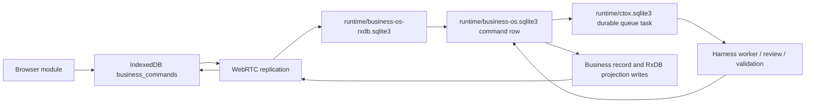
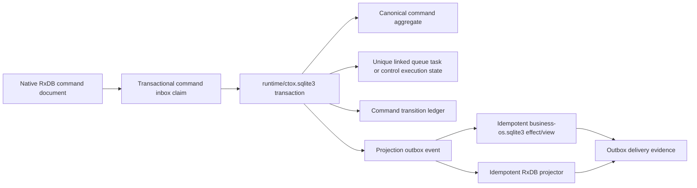

# CTOX Sync Engine and Command Bus Hardening Plan

Status: hardening reopened for recovery/supervision/saga wave; focused checks pass; commit-bound no-retry release soak pending

Scope: `ctox-rxdb`, browser IndexedDB, WebRTC replication, Business OS command ingestion, durable queue and harness writeback

Last reviewed: 2026-07-11

Implementation checkpoint (2026-07-10):

> The 3 × 31 result below qualifies the earlier checkpoint only. It does not
> qualify the current recovery/supervision/saga changes. “Complete” now
> requires native terminal backpressure, browser journal replay plus encrypted
> export/import, complete critical-task supervision, and a clean-tree,
> commit-bound 3 × 31 no-retry release soak on the resulting commit.

- The exact `.github/workflows/rxdb-soak.yml` release profile passed locally:
  three cycles, 31 required modes per cycle, 93 first-attempt executions and
  zero retries (`ok=true`). The retained result is
  `runtime/build/rxdb-soak-summary-local-20260710-v15.json`.
- The release soak exposed and closed additional production-shaped gaps:
  capability prewarming before protected demand replication, signed raw smoke
  commands, separated server/navigation readiness budgets, streamed `onChunk`
  delivery, bounded large-file previews, active queue workspace discovery, and
  priority recovery of Command Bus collections after a native midflight
  restart instead of joining the global reconnect storm.
- Tombstone and stale-generation diagnostics now exercise the product's
  file-demand boundary rather than assuming query replication for
  `desktop_file_chunks`; empty hashed streams are correctly classified as
  integrity mismatches and retained in Advanced Status.

- Phase-0 architecture gates are recorded in tracked `HARNESS.md`; the native
  router rule is the authoritative control/queue classifier.
- The lifecycle-v2 fixture, Rust/JavaScript generators, transition validators,
  result-envelope field contract, and drift guards are implemented. The
  capability is now advertised by browser and native peers after queue and
  control acceptance gained native-owned v2 shadow lifecycle projections.
  Browser-owned intent fields remain immutable, are persisted in the canonical
  Business OS projection, and survive duplicate/restart replay.
- Command Bus now separates `submit`, `waitForAccepted`, `waitForTerminal`,
  `getStatus`, and `subscribe`; admission no longer waits for
  `ctox_queue_tasks`, command waits no longer restart the shared room, sync
  errors propagate, timeouts clear their timers, capability fetch is bounded
  and negatively cached, and duplicate ids are immutable payload-hash checked.
- Queue creation passes `idempotency_key = command_id`; review feedback retains
  the original command-bearing prompt; both are regression-tested.
- Query/file native in-flight registries are peer-scoped and use locked atomic
  admission. Browser collectors have a post-ack terminal deadline that rejects,
  releases state, emits diagnostics, and sends peer-scoped cancel.
- OBS-01 now has a retained heartbeat/status sink: command intake attempts,
  processed/error/retry/exhaustion counters, native-observation latency,
  pending-sync count and oldest pending age are exposed without adding a new
  metrics subsystem.
- Phase-0 inventories are executable drift guards: 41 exact control types, 13
  native control predicates, 123 browser-observed literal command types, 27
  dispatch consumers and 22 native `task_id` writers are classified. All six
  duplicated browser projection wait loops and the final direct intent writer
  have been removed.
- Native intake retry history is persisted. Exhaustion creates canonical
  failure evidence before projection, while projection-only failures can no
  longer overwrite an already accepted aggregate. `ctox business-os commands
  diagnostics --json` exposes intake, projection and task-link invariants.
- Browser command metrics now feed Advanced Status with bounded local-submit,
  submit-to-native and terminal-to-browser samples plus watcher/timeout counts;
  command-triggered restart count is explicitly pinned to zero.
- The canonical command aggregate, queue link, transition/result/effect ledgers
  and projection outbox now live in `ctox.sqlite3`. Queue admission/link creation
  is one transaction; compatibility Business OS/RxDB stores are outbox-delivered
  projections with retry, dead-letter, reconciliation, inspection and GC tools.
- Harness lease, result, review, validation, rework and terminal correlation are
  durable and share one generated lifecycle. Direct compatibility handlers and
  the orphan reconciler cannot bypass the core terminal owner.
- IndexedDB now has version-change/blocking handling, persistent checkpoints,
  an unsynced-write recovery journal, multi-tab demand coordination, global
  cache budgeting and dirty/pushable eviction guards. Demand collectors,
  pending requests and send queues are count/byte bounded and fair.
- Whole-document conflicts use a browser-device HLC preserved over the Rust
  wire boundary; command/queue collections remain native-authoritative and
  unsafe structured list/rich-text merges fail visibly.
- Current-wave verification: the browser suite passes all 67 tests with zero
  skips, including its Browser/Rust cross-process cases and a real two-tab
  Web-Lock/BroadcastChannel leader handover; the native
  `ctox-rxdb` suite passes 300 unit tests, 31 conformance tests and the idle
  budget test. Root `cargo check --bin ctox`, the native signaling-circuit
  tests, terminal backpressure test and Saga compensation/terminal-owner test
  pass. Syntax, workflow, bundle reproducibility and diff guards pass. The
  earlier three-cycle release soak remains historical evidence only; the
  clean-tree, commit-bound release soak for this wave is still pending.
- A 2026-07-11 one-cycle technical no-retry run passed the first 18 modes, then
  stopped because the `tab-freeze-browser-to-rust` CTOX child received an
  external/startup `SIGTERM` before listening. The freeze mode passed in a
  separate one-attempt diagnostic run, and all remaining 12 modes passed in a
  separate one-attempt matrix. This proves each of the 31 functional paths but
  deliberately does not qualify a contiguous 31-mode or release soak. The
  unexplained startup termination remains a release-gate finding.
- The Business OS app-platform contract is now explicit: direct app CRUD,
  local persistence and permission-filtered realtime sync are the default;
  the remaining product gate is runtime installation of a previously unknown
  schema and declarative action into an already-running binary without Rust
  edits, a rebuild or a developer-triggered daemon restart.

## 1. Purpose

This plan hardens the two paths that carry the most operational risk in Business OS:

1. CTOX Sync Engine between browser IndexedDB and native SQLite.
2. The command path from a browser action through `business_commands`, the durable CTOX queue and harness, back to an authoritative browser-visible result.

The goal is not merely to reduce visible timeouts. The goal is to make every accepted command and every replication transition explainable from durable state, bounded under failure, idempotent under retry and observable end to end.

The desired outcome is:

- no lost acknowledged browser write;
- no duplicate command side effect;
- no command stuck because a secondary projection is late;
- no transport restart used to repair an application-state uncertainty;
- no harness execution based only on a truncated prompt when canonical command data exists;
- no terminal command result before review, validation and writeback evidence are durable;
- no green health state without a proven native peer, command consumer and replication progress path.

## 2. Non-negotiable architecture rules

- Business OS data remains WebRTC/RxDB-only. This plan must not add an HTTP data bridge or fallback.
- Business OS apps are client packages by default. A runtime-installed app may
  add schemas and safe, declarative app actions without editing Rust, changing
  generated core fixtures or rebuilding the CTOX binary. Echtzeitsync is the
  default collection mode; server-authoritative grants still decide who may
  read or write.
- Direct app CRUD uses shell-provided collection handles. The Command Bus is
  not a requirement for ordinary single-collection edits and must not turn
  every new UI action into a native API implementation.
- App-specific command names are runtime metadata. Safe data mutations and
  collection-spanning workflows must be handled by a generic, schema- and
  permission-checked runtime action/Saga registry. Compiled handlers remain
  reserved for explicit core or privileged host capabilities.
- Runtime action definitions may select only bounded platform primitives. They
  cannot carry arbitrary SQL, filesystem paths, shell commands or executable
  browser code into the native process.
- The current store topology must be represented truthfully: canonical Business OS command rows live in `runtime/business-os.sqlite3`, durable queue/review state lives in `runtime/ctox.sqlite3`, and replicated command documents live in `runtime/business-os-rxdb.sqlite3` plus browser IndexedDB.
- No design may claim one atomic transaction across those WAL databases. The recommended target is to move the command admission/lifecycle aggregate into `runtime/ctox.sqlite3` so it can commit with its queue link; `business-os.sqlite3` then retains domain state and a compatibility/materialized command view. Phase 0 must ratify this in an architecture decision before implementation depends on it.
- Browser IndexedDB remains the local-first working store, not the source of server-side permissions or terminal work truth.
- Native SQLite/RxDB remains the replicated Business OS peer store.
- Browser modules receive database handles from the shell and do not create independent sync paths.
- Permission decisions remain native and server-authoritative.
- Runtime configuration goes through typed configuration, the runtime store or the secret store; no new production environment toggles.
- Generated wire and schema contracts must be changed through their fixtures and generators.
- The forked harness remains an execution component. CTOX owns persistence, review, validation, retry and terminal completion.

### Runtime app acceptance gate

The hardening program is not complete until an already-running release binary
can install an unknown app package containing a new schema and a new
declarative action, automatically reconcile the native peer, and synchronize
an offline write between two authorized browser profiles. The same test must
prove denial for an unauthorized profile, idempotent action replay, durable
audit/status projection, reload and leader handover – with no source edit,
`cargo build`, HTTP data fallback or developer-triggered daemon restart.

## 3. Current path and failure boundary

Today one queue-backed command crosses at least five durable or semi-durable representations:



The handoffs span three native SQLite databases plus browser IndexedDB and cannot be one WAL transaction in the current topology. Current recovery relies on a mixture of polling, projection repair, retries and collection restarts. This makes it difficult to distinguish:

- command not yet replicated;
- command rejected by policy;
- command accepted but queue projection delayed;
- queue task leased but harness not progressing;
- work completed but terminal projection delayed;
- browser reading a stale database generation;
- transport or native consumer actually unhealthy.

The target design separates those conditions explicitly.

## 4. Confirmed command-path findings

These findings are based on the current implementation, not only on the documented contract.

### P0: ambiguous acknowledgement semantics

`createCommandBus().dispatch()` currently has two meanings:

- queue-backed commands resolve when a linked queue projection exists, normally while the command is only `accepted`;
- direct/control commands resolve when the command itself is terminal.

Callers therefore cannot infer whether a resolved promise means “durably admitted” or “completed”. The shell adds another `waitForCommandProjection()` call, but that returns on every state other than `pending_sync`, including `accepted`, so it does not actually wait for terminal completion.

### P0: `task_id` has multiple meanings

The browser infers command class from the presence of `task_id`. Native control handlers also use `task_id` for domain record identifiers or target queue tasks. For example, workspace-branding completion writes `WORKSPACE_BRANDING_ID` into `task_id`, even though no command-execution queue projection exists for that id.

This can cause a completed control command to wait for a nonexistent `ctox_queue_tasks` document until timeout. The contract needs distinct fields:

- `execution_task_id`: queue task created to execute this command;
- `target_task_id` or `target_record_id`: domain object acted upon by a control command.

Command class must be explicit and must never be inferred from either field.

### P0: sync errors are converted into latency

The browser bus swallows errors in readiness, push and pull helpers. It then polls and periodically restarts `business_commands` and `ctox_queue_tasks`. A rejected push, closed collection or schema error can therefore become a 45-second generic timeout instead of an immediate typed failure.

Collection restarts are especially harmful because both collections share a multiplexed room peer. A command tracker must not reset transport state as an ordinary polling action.

### P0: core acceptance is not one atomic handoff

Queue-backed acceptance currently creates or discovers a queue task before inserting the canonical `business_commands` row. The queue operation and command insert use separate calls/connections. A crash or insert failure between them can leave an orphan queue task. The later Business OS record and RxDB projection writes are additional non-atomic handoffs.

Existing repair functions are valuable, but repair must be a fallback behind a transactional inbox/outbox design rather than the normal consistency mechanism.

### P0: direct side effects can happen before the durable idempotency claim

Native acceptance checks whether `command_id` already exists, closes that read connection and then dispatches direct/control handlers. Several handlers perform their domain or external side effect before `write_rxdb_control_command_outcome()` inserts the canonical command row.

A process crash after the side effect but before the outcome insert leaves no durable command claim. Replaying the same browser command can execute the side effect again. A single normal consumer loop reduces concurrent races but does not make this crash window safe, and trusted-local/CLI paths can enter the same acceptance function.

The native inbox claim must therefore commit before every side effect. Individual effectors also need an idempotency key or effect ledger when the external system cannot participate in the core SQLite transaction.

### P0: harness context is a bounded preview, not the canonical command

The queue prompt contains at most a bounded payload/client-context preview and explicitly says the full JSON is stored on the command record. The harness entry path does not attach that canonical record as typed execution context, and no dedicated read-only command-inspection tool is part of the worker contract.

Consequences:

- a required field can be truncated out of the prompt;
- rework can operate on a stale prompt copy;
- the model may query raw SQLite ad hoc or simply guess;
- sensitive client context is mixed into prose rather than mediated by a typed context renderer;
- command freshness and attachment-generation validity are not proven at lease time.

### P0: review rework destroys prompt-carried command identity

`apply_review_feedback_to_leased_queue()` replaces the queue task prompt with the review feedback prompt. Existing recovery and command-specific paths still parse `command_id`, module targets and other metadata out of prompt lines. A rework attempt can therefore lose the very command link needed for writeback or recovery.

This is stronger than merely having stale prompt data: prompt text is currently acting as a mutable foreign-key carrier. Phase 1 must preserve the original prompt as an interim fix, and Phase 3 must eliminate prompt parsing in favor of an indexed typed command link.

### P0: terminal writeback still depends on assistant reply text

Several harness completion paths call `complete_business_command_from_queue_reply(..., reply_text)`. This is appropriate for a chat message body, but insufficient as the execution contract for structured writeback, artifacts, validation evidence and failure classification.

Assistant prose must not be the only carrier of terminal data. The command needs a typed execution result and references to durable artifacts/evidence.

### P1: acceptance waits on a secondary projection

For queue-backed work, the browser waits for both a command `task_id` and a replicated `ctox_queue_tasks` document. Once native acceptance has atomically committed the command/task link, the command receipt itself is sufficient proof of admission. A delayed queue projection should affect UI detail, not command acceptance.

### P1: retry mutates the original command envelope

On an RxDB conflict the browser patches the existing command document back to the submitted shape, including `pending_sync`. This can temporarily regress a terminal or accepted local projection. Reusing a command id with different payload is not protected by a payload hash.

### P1: capability acquisition fails late

If the capability endpoint is unavailable, the browser submits without a token. Native policy still fails closed for privileged replicated commands, which is correct for security, but the user receives a delayed command failure. The capability `fetch()` itself has no deadline, is awaited before every uncached dispatch and does not negatively cache a failed lookup, so a hanging endpoint can block submission indefinitely and repeated failure can amplify control-plane load. Commands that require privileged capability should fail before insertion or be explicitly recorded as `waiting_for_auth`, not silently degrade.

### P1: timeout races leave live timers behind

Readiness, flush and refresh helpers race an operation against `delay(15_000)` but do not cancel the timer when the operation finishes first. The focused command-bus unit suite completes its actual command assertion in about 1.3 seconds yet the Node process remains alive for roughly 16 seconds because these timers are still pending. In the browser this creates avoidable timer/reference churn on every dispatch.

Use one cancellable `withTimeout()` helper that clears its timer in `finally`, preserves the original error and records whether timeout or operation completion won.

### P1: lifecycle state is flattened

Transport status, native ingestion, queue routing, harness execution, review, validation and projection delivery are folded into a small set of strings such as `pending_sync`, `accepted`, `queued`, `running` and `completed`. Status mappings in different layers are not a single generated contract and can regress when an older projection arrives late.

### P1: exhausted native acceptance can exist only as a projection failure

The native consumer's per-command acceptance budget is an in-memory map. When it is exhausted, the consumer best-effort patches the RxDB command projection to `failed` without first creating a durable canonical command/intake-failure row. A restart loses the retry history, and the failure may be visible in the browser while absent from the canonical store.

### P1: queue terminal updates are swallowed and can be re-derived backwards

Several completion handlers intentionally ignore errors from `channels::update_queue_task(...)`. A later projection refresh derives command state again from queue `route_status`. Command completion and queue terminalization therefore have multiple writers, and a swallowed queue update can drive a later projection away from the already-completed command result.

### P1: command waiting interferes with global sync recovery

The command bus periodically calls `restartCollections()`. That path clears the sync runtime's global repair timer before restarting the command collections. A stuck command watcher can therefore delay the transport recovery mechanism that should own the failure.

### P1: `business_commands` has no explicit merge owner

`business_commands` uses whole-document LWW. The browser writes and retry-patches the same document that native status/result projection overwrites. The proposed immutable envelope and state-rank rule are insufficient until one layer is named as merge owner and the browser/native ownership handoff is enforced in storage and projection code.

## 5. Target command architecture

### 5.1 Separate transport, execution and terminal state

The command projection should expose three independent dimensions:

```text
replication_phase: local | pushed | native_observed
execution_phase:  waiting_dependencies | accepted | queued | leased | running |
                  awaiting_review | validating | retry_wait | blocked | terminal
terminal_status:  none | completed | failed | cancelled
```

The exact serialized values must live in one generated command contract shared by Rust and browser JavaScript.

The browser API should become:

```js
const receipt = await commandBus.submit(command);
// receipt proves a local durable write and provides command_id.

const accepted = await commandBus.waitForAccepted(receipt.command_id, options);
// accepted proves native canonical admission; queue projection is optional.

const terminal = await commandBus.waitForTerminal(receipt.command_id, options);
// terminal resolves only for completed, failed or cancelled.
```

A compatibility `dispatch(command, { until })` can remain during migration, but `until` must be explicit. New code must not use a promise whose completion semantics depend on command type.

### 5.2 Make the command envelope immutable and idempotent

Add or standardize these fields:

| Field | Purpose |
| --- | --- |
| `contract_version` | Generated command contract version. |
| `command_id` | Stable browser-generated operation id. |
| `idempotency_key` | Logical user action key; defaults to `command_id`. |
| `payload_hash` | Canonical SHA-256 over immutable type/module/payload/context references. |
| `execution_mode` | `control` or `queue`; set authoritatively by native classification. |
| `execution_task_id` | Durable queue task executing this command, if any. |
| `target_record_id` / `target_task_id` | Domain object acted upon. |
| `projection_version` | Native monotonic aggregate version. |
| `attempt` | Current harness attempt/rework number. |
| `result` / `result_ref` | Typed inline result or reference to durable result/artifacts. |
| `error_code`, `error_message`, `retryable` | Stable failure classification. |

Rules:

- The initial browser envelope is append-only from the browser's perspective.
- Retrying the same `command_id` and same `payload_hash` returns the existing receipt/outcome.
- Same `command_id` with a different hash is a terminal idempotency conflict.
- Native projections may advance lifecycle fields but may never replace immutable intent fields.
- Projection versions and a state-rank check prevent terminal-to-active regression.
- Ownership is phase-based and explicit: the browser owns initial immutable intent only until native observation; native owns lifecycle, result and error fields after observation. The browser must never patch native-owned fields back to `pending_sync`.
- Phase 0 must choose and test the enforcement point: either a collection-specific merge/acceptance rule for `business_commands` or separate intent and native-state documents. Whole-document LWW alone is not an acceptable owner.

### 5.3 Durable native inbox, core aggregate and projection outbox

Current command, queue and RxDB state live in three WAL databases. SQLite cannot provide the required atomic commit across them. The target below therefore depends on the recommended Phase-0 store-topology decision: move the canonical command admission/lifecycle aggregate into `runtime/ctox.sqlite3`, where it can share a unit of work with the durable queue. Keep `runtime/business-os.sqlite3` as domain storage plus a compatibility/materialized command view, and reach both Business OS stores through idempotent outbox effects.

If that recommendation is rejected, the plan must not pretend the current stores are atomic. The alternative is to commit the command claim first and deliver queue creation itself as an idempotent outbox effect keyed by `command_id`, accepting an explicit `accepted_waiting_queue` state.



Required invariants:

1. One `command_id` maps to at most one command execution task.
2. The queue link is a real indexed relation, not inferred by scanning prompt text or JSON metadata.
3. Under the recommended topology, canonical command acceptance and queue creation commit together in `runtime/ctox.sqlite3` through transaction-aware queue APIs.
4. Every committed state transition creates an outbox event in the same transaction.
5. Projector retries are bounded/backed off and idempotent by aggregate id plus version.
6. A projection failure cannot roll back canonical work and cannot silently disappear.
7. Boot reconciliation verifies command/task/outbox invariants and records repairs as evidence.
8. Native intake failure/retry count is durable. Exhausting intake retries creates a canonical failed receipt or intake-failure aggregate before projecting failure to the browser.
9. External/domain side effects execute only after the durable inbox claim and carry a command/effect idempotency key.

Suggested core tables or equivalent typed migrations:

```text
business_command_inbox
business_commands               # extended canonical aggregate
business_command_task_links      # UNIQUE(command_id), UNIQUE(execution_task_id)
business_command_transitions     # append-only lifecycle evidence
business_projection_outbox       # retryable cross-store delivery
business_command_effects         # idempotency/evidence for domain and external effects
```

The current `runtime/business-os.sqlite3.business_commands`, `business_records` and repair surfaces can remain during migration as compatibility views/materializations, but direct multi-store projection writes should move behind the outbox projector.

Immediate pre-migration protection: `create_queue_task_with_metadata()` already derives a stable task id when `extra_metadata.idempotency_key` is present. `create_ctox_queue_task()` must pass `idempotency_key = command_id` in Phase 1, with a regression test proving crash-retried creation returns the same queue task. This reduces duplicate tasks but does not replace the inbox/topology work.

### 5.4 Typed harness context

Add a typed context to leased Business OS work instead of relying on prompt embedding:

```rust
struct BusinessOsCommandWorkContext {
    command_id: String,
    payload_hash: String,
    command_type: String,
    module_id: String,
    actor: AuthorizedActorSnapshot,
    scope: AuthorizedScopeSnapshot,
    payload: serde_json::Value,
    client_context: SanitizedClientContext,
    attachments: Vec<VerifiedAttachmentRef>,
    execution_task_id: String,
    attempt: u32,
}
```

At lease time the service must:

1. Resolve the queue task's indexed command link.
2. Load the full canonical command.
3. Verify payload hash and current non-terminal state.
4. Revalidate permissions required for execution or external effects.
5. Verify attachment generation/hash references and materialized paths.
6. Attach the typed context to the worker slice.
7. Render only a bounded summary into prose while keeping exact data available through typed context/tool access.

Provide a read-only, policy-aware inspection surface such as:

```text
ctox business-os commands inspect <command-id> --json
```

The in-process harness should preferably use a typed internal tool/repository rather than shelling out, but the CLI is useful for operators and reproducible diagnostics. It must redact secrets and must not execute the command.

### 5.5 Typed harness result and terminal gate

Define a durable result contract:

```rust
struct BusinessOsCommandExecutionResult {
    command_id: String,
    execution_task_id: Option<String>,
    attempt: u32,
    user_message: Option<String>,
    structured_output: serde_json::Value,
    artifacts: Vec<ArtifactRef>,
    writebacks: Vec<WritebackEvidence>,
    verification_claims: Vec<VerificationClaimRef>,
    retry: Option<RetryDisposition>,
    error: Option<TypedCommandError>,
}
```

Terminal ordering:

```text
harness result persisted
  -> completion review passed
  -> required validation passed
  -> required artifacts/writebacks proven
  -> command + queue terminal transition committed
  -> projection outbox event committed
  -> browser observes terminal projection
```

Chat text may still come from the assistant reply, but command success must be grounded in the typed result and durable review/validation evidence.

## 6. Sync Engine work packages

### SYNC-01: bounded demand-stream lifecycle — P0

- Key query/file in-flight registries by `(peer_id, request_id)`.
- Replace `load -> check -> fetch_add` admission with an atomic semaphore/permit.
- Preserve the existing native query/file runtime deadlines; add the missing browser collector deadline after fetch acknowledgement so an open peer with missing terminal chunks cannot hang forever.
- Authorize cancel against the issuing peer. A peer must not cancel another peer's stream by guessing/reusing its request id.
- Bound queued client requests by count and bytes.
- Bound accepted stream bytes, not only request count. File fetch must incrementally consume/decode chunks or spill to a bounded sink instead of retaining an entire base64 file in `fileCollectors`.
- On timeout, cancel the native stream, reject the collector and release every permit exactly once.
- Add duplicate, late-chunk, missing-terminal-frame and peer-disconnect tests.

Acceptance:

- no collector or permit remains after timeout/disconnect;
- concurrent admission never exceeds configured maximum;
- identical request ids from different peers cannot interfere or cross-cancel;
- accepted file streams remain under a configured browser memory budget.

### SYNC-02: bounded and fair send queues — P0

- Add per-peer byte and frame budgets on browser and Rust queues.
- Use weighted fair scheduling or priority aging instead of strict High/Normal/Low starvation.
- Never send merely because a backpressure wait timed out.
- A wedged channel must trip a typed connection failure/circuit breaker.
- Export queue age, bytes, dropped/rejected frames and oldest-item age.

Acceptance:

- memory remains inside a fixed budget under a non-reading peer;
- control traffic remains responsive;
- low-priority work makes bounded progress;
- a wedged peer is disconnected and recovered instead of accumulating memory.

### SYNC-03: truthful peer and command-plane health — P0

Split health into:

- process alive;
- signaling socket connected;
- signaling join accepted;
- native/browser peer authenticated;
- DataChannel open;
- command consumer alive;
- last command ingestion progress;
- last pull/push checkpoint progress;
- projection outbox age.

`replicationUp` must not become true when only a pool object exists. Critical child tasks, including the command consumer and projection loops, must be supervised; unexpected exit must fail the run or trigger an owned restart.

### SYNC-04: room-level recovery and circuit breaker — P0/P1

- Remove collection restarts from command waiting.
- Make the restart scheduler honor the existing typed `retryable`/phase classification already emitted for signaling, schema, checkpoint, replication-I/O and lifecycle failures.
- Fill only genuinely missing classifications; do not create a parallel error taxonomy.
- Restart the shared room once, not one collection at a time.
- Stop retrying non-retryable schema/auth failures until relevant state changes.
- Preserve checkpoints only when their epoch/session validity key remains valid.

### SYNC-05: IndexedDB lifecycle and recovery — P0/P1

- Register `db.onversionchange` and close stale handles.
- Treat blocked reset/delete as blocked, never as success.
- Request persistent storage when appropriate and expose the result.
- Monitor `navigator.storage.estimate()` and surface pressure before failure.
- Detect/flag private browsing or ephemeral storage where feasible.
- Persist unsynced-write counts and warn before destructive recovery.
- Replace the unmerged recovery database with a recovery journal or deterministic merge-back protocol.
- Handle `visibilitychange`, `freeze`, `resume`, `pagehide` and `document.wasDiscarded` without assuming every event fires.

Recovery acceptance:

- an offline write made in recovery storage is either merged to the primary database and pushed exactly once or remains visibly quarantined for operator/user recovery;
- no recovery marker is cleared while unique unsynced data remains;
- page discard/reload cannot silently lose the only copy of an acknowledged local write.

### SYNC-06: persistent browser checkpoints — P1

- Persist pull/push checkpoints with collection, remote storage epoch, native session id and schema hash.
- Restore only after all validity fields match.
- Clear atomically on local reset, schema migration or remote generation change.
- Add reload, crash and stale-checkpoint tests.

### SYNC-07: production multi-tab coordination — P1

- Wire the existing broker into actual query-demand loading.
- Add deterministic tie-breaking for simultaneous claims.
- Add lease renewal and owner liveness.
- Bound follower waits and allow safe takeover.
- Decide whether command submission needs a similar per-id tab broker or only idempotent native admission.

### SYNC-08: cache and quota policy — P1

- Replace per-collection 128 MiB defaults with a global origin budget plus per-collection shares.
- Restore temporary quota-tightening after a successful retry.
- Wire the existing `QueryMetaStorage.markDirty()`/dirty guards to real local write and successful-push transitions; today the guards exist but production writes do not mark documents dirty.
- Before `primaryDelete`, verify the primary record is not `pushable`/locally unsynced. Sidecar metadata alone must not authorize deletion.
- Export estimated/actual usage and eviction reasons.
- Use one scheduler per database rather than one timer per collection.

### SYNC-09: conflict semantics — P1/P2

- Document which collections are whole-document LWW, top-level field merge or server-authoritative.
- Add logical/Hybrid Logical Clock semantics if cross-device LWW remains user-visible.
- Define delete-vs-update policy and user-visible conflict reporting.
- Do not apply top-level field merge to list, rich-text or ordered collaborative structures without a suitable CRDT/operation model.
- Identify multi-record invariants that must be validated natively rather than inferred from eventual consistency.

### SYNC-10: signaling, TURN and reconnect policy — P1

- Keep the browser's existing join-gated backoff reset. Change the Rust signaling client so reconnect is successful only after accepted join, not socket open.
- Apply Rust-side backoff/terminal classification to repeated control-plane rejection.
- Stop retrying revoked/protocol-incompatible peers until credentials/config change.
- Require credentialed TURN readiness for deployments that claim remote/NAT support.
- Track selected ICE candidate type and TURN credential expiry without exposing secrets.

## 7. Command Bus work packages

### CMD-01: generated command lifecycle contract — P0

- Add a fixture-generated Rust/JS contract for states, terminal statuses, execution modes, error codes and result envelope.
- Separate `execution_task_id` from target/domain ids.
- Add monotonic transition validation.
- Reject unknown or regressive transitions.
- Advertise a `ctox-command-lifecycle-v2` capability in the existing peer protocol so v1/v2 behavior is detected mechanically without relying on schema mismatch.
- Complete this package in Phase 0 before Phase 1 introduces new state names or compatibility fields.

### CMD-02: split submit, admission and completion APIs — P0

- Implement `submit`, `waitForAccepted`, `waitForTerminal`, `getStatus` and `subscribe`.
- Make `dispatch(..., { until })` an explicit compatibility wrapper.
- Update shell/module facades and remove duplicate wait loops.
- A local timeout stops waiting; it must not imply that accepted work failed or should be submitted again.
- Return a tracking receipt after timeout so the UI can reconnect to the same command after reload.

### CMD-03: fail with typed errors instead of restarting sync — P0

- Stop swallowing collection/read/push/pull errors.
- Map them to stable codes such as `sync_unavailable`, `schema_mismatch`, `auth_required`, `native_unavailable`, `projection_delayed` and `command_terminal_failure`.
- Consolidate the command bus, sync runtime, shell and shared-helper timeout copies into one timer-clearing `withTimeout()` implementation; do not add another local copy.
- Remove `restartCollections()` from the wait loop.
- Permit a bounded pull nudge only when transport is healthy and progress is merely delayed.

### CMD-04: reactive command tracking — P0/P1

- Subscribe to the exact command document instead of polling every 250 ms.
- Rebind subscriptions when the shell data-plane generation changes.
- Re-read by id after reconnect to close missed-event windows.
- Persist active command ids in shell state so tracking resumes after reload.
- Bound simultaneous watchers and garbage-collect terminal watchers.

### CMD-05: explicit dependency barrier — P0/P1

Replace “flush dependencies and hope within 15 seconds” with an explicit manifest:

```json
{
  "dependencies": [
    {
      "collection": "desktop_files",
      "record_id": "...",
      "generation_id": "...",
      "content_hash": "...",
      "required": true
    }
  ]
}
```

Native ingestion validates dependency availability before queue admission. Missing replicated data yields `waiting_dependencies` with named evidence, not a generic command timeout. When matching data arrives, the consumer retries admission without creating a second command/task.

### CMD-06: authorization readiness — P1

- Mark command types that require an authenticated capability in the generated contract.
- Give capability fetch a short abortable deadline and cache negative outcomes for a bounded cooldown to avoid hanging every dispatch or amplifying an outage.
- Fail before browser insertion when a required capability is unavailable, or persist an explicit `waiting_for_auth` intent only when that offline behavior is product-approved.
- Revalidate permission at native admission and again before external/destructive execution when appropriate.
- Keep claimed browser actor context non-authoritative.

### CMD-07: idempotent immutable retry — P0

- Never patch a terminal command back to `pending_sync`.
- Compare payload hash on duplicate id.
- Provide `resumeTracking(command_id)` separately from `resubmit`.
- If product UX offers “retry”, create a new command id linked by `retry_of_command_id`, unless the prior command was never natively observed.
- Enforce the Phase-0 merge-owner decision: browser writes immutable intent only; native owns lifecycle/result after observation.

### CMD-08: command/queue projection simplification — P1

- Treat the command receipt as authoritative admission proof.
- Make `ctox_queue_tasks` an operational detail projection, not a prerequisite for `waitForAccepted`.
- Use indexed command/task links in core SQLite.
- Remove prompt-text fallback matching once migration is complete.
- Add a projector/reconciler that proves every queue-backed nonterminal command has exactly one linked task.

### CMD-09: cancellation and deadlines — P1

- Define browser cancellation as a command transition, not local document deletion.
- Map cancellation to pending queue removal or cooperative harness cancellation.
- Distinguish watcher timeout, command deadline, queue lease timeout and harness turn timeout.
- Persist who cancelled, when, why and whether side effects had already begun.

### CMD-10: retention and garbage collection — P2

- Retain command intent, transition ledger and terminal summary according to policy.
- Move large results to artifact references.
- Garbage-collect redundant browser projections only after terminal delivery and retention requirements are satisfied.
- Never delete the only evidence needed to explain a queue/harness outcome.

## 8. Harness integration work packages

### HAR-01: typed Business OS worker source — P0

- Extend `QueuedPrompt` or the worker-source model with a typed Business OS command reference/context.
- Resolve full canonical state at lease time.
- Do not make the agent parse command identity and target metadata out of prompt prose.
- Preserve the same typed context across review/rework slices.

### HAR-02: policy-aware command inspection — P0/P1

- Add a read-only internal repository/tool and operator CLI for command inspection.
- Return exact payload, sanitized context, state, linked task, dependencies, attachments and transition history.
- Redact capability tokens and secrets.
- Record inspection in process evidence when used by a worker.

### HAR-03: typed execution result — P0

- Persist a structured result before review.
- Separate user-facing reply text from artifacts, writebacks, claims and error disposition.
- Require command-specific validators for structured outputs.
- Make terminal command writeback consume the typed result, not scrape assistant text.

### HAR-04: one terminal transition owner — P0

- Centralize the queue/command terminal transition after review and validation.
- Avoid one path updating the queue, a second path updating the command and a third path projecting both.
- Under the recommended core-command topology, commit canonical terminal command, task state, result and outbox event in one `runtime/ctox.sqlite3` transaction; deliver Business OS/RxDB views afterward through the outbox.
- Make repeated terminalization idempotent.
- Treat queue-terminal update failure as a hard transition failure or durable outbox retry, never `let _ = ...`.

### HAR-05: retry/rework continuity — P1

- Reuse the same command and execution task for review rework where the current state machine requires same-main-work continuation.
- Increment an explicit attempt counter.
- Persist failure/review feedback as typed attempt evidence.
- Do not create recursive commands or queue tasks for normal rework.
- Interim Phase-1 rule: append review feedback without deleting the original prompt/command metadata. Final rule: no command link, module target or writeback routing may be parsed from mutable prompt text.

### HAR-06: end-to-end correlation — P1

Carry these ids through queue, turn, process mining, harness flow, review, validation and projection events:

- `command_id`;
- `execution_task_id`;
- `thread_key`;
- `turn_id`;
- `attempt`;
- `projection_version`;
- relevant artifact/claim ids.

The Business OS UI and `ctox harness-flow` should render the same correlated timeline.

## 9. Observability and SLOs

### OBS-01: establish command-plane telemetry sinks — P0

The core does not currently expose a general Prometheus/OpenTelemetry metrics pipeline. Phase 0 must not require a dashboard that has no data sink. Build on existing infrastructure first:

- in-process atomic counters and latency histograms included in the native peer heartbeat/status snapshot;
- browser command/sync diagnostics folded into the existing Advanced Status envelope;
- durable command transition, invariant-repair and terminal failure events in the existing process-mining/harness-flow evidence stores;
- a read-only `ctox business-os commands diagnostics --json` operator surface;
- explicit dropped-event counters when forensic writes are lossy.

Only add an external metrics exporter through a separate architecture decision. OBS-01 is complete when the baseline can be captured and compared in CI/soak artifacts without requiring a new service.

Add these first-class command-plane metrics:

| Metric | Purpose |
| --- | --- |
| local submit latency | IndexedDB write health. |
| submit-to-native-observed | WebRTC and native ingestion latency. |
| native-observed-to-accepted | policy/dependency/core transaction latency. |
| accepted-to-lease | queue pressure and dispatcher latency. |
| lease-to-result | harness execution latency. |
| result-to-review / validation | review pipeline health. |
| terminal-to-browser-observed | projection/WebRTC latency. |
| oldest pending command age | stuck-command alert. |
| oldest projection outbox age | cross-store delivery alert. |
| orphan command/task link count | invariant health. |
| duplicate admission/effect count | idempotency health; target must be zero. |
| command watcher/restart count | browser recovery quality; command-triggered restarts target zero. |

Initial service objectives should be measured before hard thresholds are locked. Recommended local/LAN starting targets:

- local submit p95 below 100 ms;
- native observation p95 below 2 s while peer/data channel are healthy;
- terminal projection p95 below 2 s after outbox commit;
- zero duplicate command effects;
- zero nonterminal commands without an explainable owner/state beyond the configured alert window;
- zero command-bus-induced room restarts.

Health output must report the stage at fault rather than only “sync unhealthy”.

## 10. Verification strategy

### 10.1 Model/state-machine tests

- Generate all valid command lifecycle transitions.
- Reject terminal regression, illegal mode changes and payload-hash changes.
- Prove every successful queue-backed path crosses accepted, review passed and validation passed where required.
- Prove every retry consumes a finite budget.

### 10.2 Crash-point tests

Inject failure after each boundary:

1. browser local insert;
2. WebRTC push acknowledgement;
3. native RxDB persistence;
4. core inbox claim;
5. canonical command insert;
6. queue task creation;
7. outbox commit;
8. RxDB projection write;
9. harness lease;
10. harness result persistence;
11. review/validation;
12. terminal projection delivery.

For every point, restart the relevant process/page and assert convergence, no duplicate task/effect and an explainable final state.

### 10.3 Browser tests

- two tabs submit the same command id and hash;
- two tabs submit same id with different hash;
- page reload during `pending_sync`, accepted, running and terminal projection;
- IndexedDB upgrade blocked by an old tab;
- recovery DB contains an offline write;
- storage pressure and quota retry;
- background freeze/discard and later restore;
- data-plane generation replacement while watching a command;
- hanging capability endpoint, capability timeout and negative-cache cooldown;
- v1/v2 command capability combinations without a Business OS schema-hash mismatch.

### 10.4 Transport tests

- signaling rejection, disconnect and credential rotation;
- missing TURN/direct path;
- non-reading DataChannel peer;
- strict high-priority load with low-priority progress assertion;
- lost query/file terminal chunk;
- duplicate request ids across peers;
- peer A cannot cancel peer B's query/file request;
- accepted large-file stream stays below the browser byte budget;
- native peer restart during command submission and terminal projection.

### 10.5 Harness tests

- full payload larger than prompt preview remains available through typed context;
- stale payload hash is rejected at lease;
- attachment generation changes before execution;
- worker timeout then retry on same task;
- reviewer rejection and same-main-work requeue;
- review feedback cannot remove command identity or target metadata;
- validator failure and bounded rework;
- worker success with terminal projection failure, followed by outbox recovery;
- exhausted native intake retries produce durable canonical failure evidence before browser projection;
- queue terminal update failure cannot be swallowed or regress a completed command;
- reply prose says “done” but typed evidence is incomplete: command must not complete.

### 10.6 Release gates

- Keep `node src/apps/business-os/rxdb/tests/run-all.mjs` green.
- Keep `cargo test --manifest-path src/core/rxdb/Cargo.toml` green.
- Add focused command contract/inbox/outbox/harness tests to the main Rust suite.
- Evolve `command-bus-projection-smoke`, schema-hash guards and LWW-origin guards in the same change as their intentional contract updates.
- Rebuild `dist/ctox-rxdb-js.mjs` from source and bump all required identical `?v=` cache-busters for browser runtime changes.
- Run direct Browser/Rust command modes with `SMOKE_MATRIX_ATTEMPTS=1`.
- Promote soak to a required scheduled/release gate with no accepted retry.
- Fail on resource-budget breach, stuck collectors, orphan links, duplicate effects or command-triggered restarts.

## 11. Implementation sequence

### Phase 0: baseline and contract freeze

1. Implement OBS-01 far enough to capture current command latency, stage ownership and stuck-state evidence through existing status/process-mining sinks.
2. Inventory command types and classify each as control or queue-backed.
3. Inventory every current use of `task_id` and separate execution vs target semantics.
4. Inventory every browser/module/Desktop consumer and duplicated command wait loop.
5. Ratify the store-topology ADR. Recommended: move the canonical command admission/lifecycle aggregate to `runtime/ctox.sqlite3`; keep `business-os.sqlite3` as domain storage/compatibility view and use outboxes for cross-store effects.
6. Ratify the `business_commands` merge-owner ADR. Recommended: browser owns immutable initial intent; native owns lifecycle/result after observation; no retry patch writes native-owned fields.
7. Define the schema-hash-safe rollout: v2 shadow fields through current `additionalProperties: true`, explicit handshake capability and no schema/index change during the mixed-version window.
8. Complete CMD-01's generated Rust/JS lifecycle contract before other packages introduce state constants.
9. Add regression tests for every confirmed finding before changing behavior.

Exit criteria:

- command-type inventory is complete;
- OBS-01 emits a retained local/CI baseline without a new external metrics service;
- store topology, command merge ownership and schema rollout ADRs are accepted;
- generated lifecycle contract and capability are pinned by drift tests;
- tests reproduce ambiguous ack, task-id collision, swallowed sync error, capability hang, destructive rework prompt replacement and truncated harness context.

Phase 1 is blocked until these exit criteria are met.

### Phase 1: stop active damage

1. Implement SYNC-01's missing browser terminal deadlines, peer-scoped request ids, cancel authorization and accepted-stream byte budget while preserving existing native runtime deadlines.
2. Pass `extra_metadata.idempotency_key = command_id` into current queue creation as an immediate duplicate-task guard.
3. Remove command-triggered collection restarts and stop cancelling the sync runtime's global repair timer from a command wait.
4. Stop swallowing sync/read errors; map them through CMD-01's generated typed failures and consolidate cancellable timeout handling.
5. Implement CMD-02's explicit submit/accepted/terminal semantics and remove the shell's misleading second wait loop.
6. Fix `task_id` ambiguity with `execution_task_id` plus target/domain compatibility fields.
7. Implement CMD-06 capability timeout, bounded negative cache and command-type auth requirements.
8. Enforce the merge-owner ADR and make duplicate command intent immutable/hash-checked.
9. Preserve original command metadata when review feedback updates the queue prompt as an interim HAR-05 fix.

Exit criteria:

- no ordinary command wait restarts a collection/room;
- callers explicitly choose admission or terminal semantics;
- completed control commands cannot wait for a domain id in `ctox_queue_tasks`;
- repeated queue creation for the same command id returns the same task;
- capability outage is bounded and typed;
- rework cannot delete the current command id from a task.

### Phase 2: transactional command core

1. Execute the Phase-0 topology ADR: add the canonical command inbox/aggregate and indexed task-link schema to `runtime/ctox.sqlite3`, or explicitly implement the alternative queue-as-outbox-effect design.
2. Add transaction-aware queue APIs so, under the recommended topology, command claim plus queue task/link commit in one core transaction.
3. Add append-only command transition and effect-idempotency evidence.
4. Implement CMD-05's explicit dependency manifest and durable `waiting_dependencies` transition.
5. Add outboxes/projectors for `business-os.sqlite3` compatibility/domain views and `business-os-rxdb.sqlite3` browser projections.
6. Persist intake retries/failures; exhausted acceptance must create canonical failure evidence before a browser-only failure projection.
7. Move direct/control side effects behind the durable claim and give nontransactional effects a command/effect idempotency key.
8. Implement CMD-08's authoritative receipt, indexed task link and reconciler; remove prompt-text link fallback after migration.
9. Migrate boot/periodic repair to invariant verification around the new model.

Exit criteria:

- crash tests cannot produce an orphan command/task;
- every canonical transition has a durable outbox event;
- duplicate admission returns the same aggregate without repeating side effects;
- no intake failure exists only in RxDB projection;
- Business OS/RxDB projection outage does not prevent canonical queue/harness progress and recovers through the outbox.

### Phase 3: harness data contract

1. Implement HAR-01 typed command context at lease.
2. Implement HAR-02 read-only, policy-aware command inspection in the in-process harness and `src/core/service/business_os.rs` CLI.
3. Implement HAR-03 typed worker results.
4. Implement HAR-04's single terminal transition owner after review/validation; remove swallowed queue terminal updates.
5. Complete HAR-05 retry/rework continuity without prompt parsing or destructive prompt replacement.
6. Implement HAR-06 correlation through harness flow and process evidence.
7. Implement CMD-09 cancellation/deadline mapping to queue and cooperative harness cancellation.

Exit criteria:

- no required command data depends on a prompt preview;
- terminal success is provable without parsing assistant prose;
- rework keeps the same command/task identity and increments attempt evidence;
- command, queue and typed result cannot disagree terminally without a visible outbox/invariant failure;
- cancellation has durable actor/reason/effect evidence.

### Phase 4: browser durability and tracking

1. Complete CMD-04 reactive watcher and reload resume across data-plane generation replacement.
2. Implement SYNC-05 IndexedDB version-change handling, storage persistence/pressure diagnostics and recovery journal/merge-back.
3. Implement SYNC-06 persistent validity-keyed checkpoints.
4. Implement SYNC-07 production multi-tab broker.
5. Implement SYNC-08 by wiring dirty/pushable eviction protection, global budgeting and scheduler consolidation.

Exit criteria:

- recovery/reload tests retain or visibly quarantine every unsynced write;
- tracking resumes after reload without resubmission;
- simultaneous tabs do not multiply demand fetches or command effects;
- no pushable local document can be evicted;
- cache budget recovers after transient quota pressure.

### Phase 5: transport resource hardening

1. Implement SYNC-02 bounded fair queues.
2. Implement SYNC-04 room-level circuit breaker using the existing retryable/error classification.
3. Implement SYNC-03 truthful join/data/consumer/progress health.
4. Supervise critical peer child tasks.
5. Implement SYNC-10's Rust signaling rejection/join-gating repair and TURN readiness policy while retaining the browser's existing join gate.

Exit criteria:

- transport memory is bounded under a stalled peer;
- health cannot be green without join/data/consumer evidence;
- non-retryable failures do not reconnect-hammer.

### Phase 6: conflict policy and long-run qualification

1. Complete SYNC-09 per-collection conflict policy, clock/delete/list/rich-text decisions and native multi-record invariants.
2. Complete CMD-10 retention, result externalization and garbage collection.
3. Perform any deferred explicit schema/index adoption only through the coordinated schema-hash rollout in §12.
4. Run required no-retry soak and chaos gates.
5. Tune SLOs and alert thresholds from measured data.

## 12. Rollout and compatibility

- `business_commands` and `ctox_queue_tasks` are schema-hash gated. A browser/native hash mismatch quiesces that collection completely; there is no data-plane fallback during version skew.
- Introduce `contract_version: 2` as shadow data under the current `additionalProperties: true` schemas first. Do not add required fields or indexes during the mixed-version window, so the pinned schema hash stays unchanged.
- Advertise `ctox-command-lifecycle-v2` in the peer handshake. Browser prefers v2 only when that capability is present and falls back to v1 behavior for an explicitly identified v1 peer.
- Native writes current compatibility fields plus v2 shadow fields during the mixed-version window. Do not infer v2 command mode from `task_id`.
- Evolve all module copies/augmentations of `business_commands` through the real schema generator chain and prove the generated merged schema remains stable.
- If v2 later requires declared fields, new indexes or a schema-version bump, choose one explicit cutover strategy: coordinated browser/native release with an acknowledged command-plane maintenance window, or a parallel v2 collection. Do not describe ordinary rolling skew as graceful.
- For a coordinated schema cutover, update module schemas and declarative migrations, regenerate `business_os_schema_contract.json` and `business_os_schema_hashes.json`, rebuild both consumers, and preflight the exact new hash before enabling writes.
- Backfill canonical command/task links from current queue metadata before enabling strict uniqueness.
- Build outbox entries for nonterminal canonical commands during migration.
- Run reconciliation in report-only mode before apply mode.
- Add counters for v1 reads and remove compatibility only after retained evidence shows zero use.
- Update guard-pinned behavior (`command-bus-projection-smoke`, schema hash/contract drift and LWW-origin tests) in the same change that intentionally evolves the contract.
- Keep the WebRTC-only boundary throughout rollout.

## 13. Definition of done

The hardening effort is complete only when all of the following are true:

- A command has one generated lifecycle contract shared by browser and native code.
- Browser submission, native admission and terminal completion are distinct APIs/states.
- Command class is explicit; `task_id` is not overloaded.
- Browser/native command merge ownership is explicit and terminal state cannot regress under whole-document LWW.
- Same command id cannot create two queue tasks or execute two side effects.
- Core command acceptance and queue link are transactional.
- Cross-store projection uses a durable outbox with observable retry/dead-letter state.
- The harness receives canonical typed command data at lease time.
- Structured terminal result and evidence are persisted before terminalization.
- Review/validation gates own terminal success.
- Browser timeouts do not restart the shared room or imply command failure.
- IndexedDB recovery cannot silently strand unique offline writes.
- Send/request queues and collectors are bounded.
- Health distinguishes process, join, peer, command consumer and progress.
- Command v1/v2 rollout cannot accidentally quiesce `business_commands` through an unplanned schema-hash mismatch.
- OBS-01 exposes retained stage latency, outbox age, orphan count and duplicate-effect evidence through existing status/process-mining surfaces.
- Required first-attempt Browser/Rust and long-run soak gates pass with zero duplicate effects, orphan links, stuck collectors and command-induced restarts.

### 13.1 Completion audit (2026-07-10)

The implementation requirements above have been audited individually. “Code
and focused tests” below means the behavior is present and covered by the local
verification suites. The prior local release soak does not qualify this wave;
CI remains the independent clean-commit deployment gate.

| Requirement | Evidence | Audit result |
| --- | --- | --- |
| One generated lifecycle contract | `business-command-lifecycle-v2.json`, its Rust/JS generator and generated consumers; lifecycle and drift tests | Code and focused tests pass |
| Distinct submit, admission and terminal APIs | `shared/command-bus.js`: `submit`, `waitForAccepted`, `waitForTerminal`, `getStatus`, `subscribe`, `resumeTracking` | Code and focused tests pass |
| Explicit command class and unambiguous task ids | Generated `execution_mode`; `execution_task_id`, `target_task_id` and `target_record_id`; executable task-id inventory | Code and focused tests pass |
| Immutable browser intent and monotonic native lifecycle | Payload-hash duplicate check, native transition validator and collection-specific conflict ownership | Code and focused tests pass |
| Idempotent task creation and effects | Atomic core claim/task link plus effect ledger keyed by command/effect | Code and focused tests pass |
| Transactional core acceptance | `business_command_aggregates`, task link and queue task are committed in one `ctox.sqlite3` transaction | Code and focused tests pass |
| Durable cross-store projection | Projection outbox with retry, backoff, dead-letter, inspect, reconcile and GC paths | Code and focused tests pass |
| Typed harness lease context | Canonical command and payload hash are resolved into durable worker context at lease and retained for rework | Code and focused tests pass |
| Typed result before terminalization | Generated result envelope carries structured output, artifacts, writebacks, verification claims and retry/error disposition | Code and focused tests pass |
| Review/validation owns terminal success | Core transition proof gates the single command/task terminal owner; compatibility projections follow through the outbox | Code and focused tests pass |
| Watcher timeout is non-destructive | Shared timer-clearing timeout helper; no command wait invokes collection/room restart | Code and focused tests pass |
| IndexedDB recovery protects offline writes | Separate `__recovery_v2` WAL, replay-before-sync, durable conflict store, encrypted export/import and quota coordinator | Current focused browser smokes pass; release qualification pending |
| Bounded transport resources | Peer-scoped native registries; count/byte limits for browser queues, collectors and accepted file streams; fair scheduling | Code, native tests and cross-process smokes pass |
| Truthful health | Heartbeat/status derives `replicationUp` from pool, accepted join, open DataChannel and complete named critical-task liveness; backlog-only progress watchdog is explicit | Code and focused tests pass |
| Safe v1/v2 rollout | Handshake capability plus schema-hash drift guards; shadow fields do not require an uncoordinated schema change | Code and contract tests pass |
| Retained command-plane observability | Heartbeat/Advanced Status metrics, durable transition evidence and command diagnostics expose latency, outbox age, orphans and duplicate effects | Code and observability smoke pass |
| First-attempt and long-run qualification | Release and CI attempts are fixed at one; release calls the reusable 3 × 31 workflow; nightly runs nine cycles; artifacts bind commit, dirty flag and bundle/binary hashes | Workflow guards pass; the current commit-bound release soak is pending |

Local verification commands used for this checkpoint:

```text
node src/apps/business-os/rxdb/tests/run-all.mjs
node --test src/apps/business-os/shared/command-bus.test.mjs
node --test src/apps/business-os/shared/app-lifecycle.test.mjs
cargo check --bin ctox
cargo test --manifest-path src/core/rxdb/Cargo.toml
cargo test --bin ctox native_signaling_
cargo test --bin ctox registered_saga_
node src/core/rxdb/tools/assert_rxdb_soak_workflow.js
node --check src/apps/business-os/app.js
node --check src/apps/business-os/shared/sync.js
git diff --check
```

Local release qualification for the earlier checkpoint is historical evidence,
not qualification of this wave. The required `.github/workflows/rxdb-soak.yml`
job must reproduce three no-retry cycles from a clean tree on the final commit
before this document may return to “implementation complete”.

## 14. Primary implementation touchpoints

Browser:

- `src/apps/business-os/shared/command-bus.js`
- `src/apps/business-os/app.js`
- `src/apps/business-os/shared/sync.js`
- `src/apps/business-os/shared/db.js`
- `src/apps/business-os/rxdb/src/storage-indexeddb.mjs`
- `src/apps/business-os/rxdb/src/replication-webrtc.mjs`
- `src/apps/business-os/rxdb/src/demand-loading-transport.mjs`
- `src/apps/business-os/rxdb/src/webrtc-native.mjs`
- `src/apps/business-os/rxdb/src/multi-tab-broker.mjs`
- `src/apps/business-os/rxdb/src/query-meta-storage.mjs`
- `src/apps/business-os/shared/business-chat.js`
- `src/apps/business-os/shared/business-reporter.js`
- every module/Desktop app discovered by the Phase-0 command-consumer inventory; do not migrate only the shell facade while direct collection/wait-loop consumers remain.

Native Business OS and RxDB:

- `src/core/business_os/rxdb_peer.rs`
- `src/core/business_os/store.rs`
- `src/core/business_os/threads.rs`
- `src/core/business_os/policy.rs`
- `src/core/business_os/capability.rs`
- `src/core/service/business_os.rs`
- `src/core/rxdb/src/plugins/replication_webrtc/query_fetch_handler.rs`
- `src/core/rxdb/src/plugins/replication_webrtc/file_fetch_handler.rs`
- `src/core/rxdb/src/plugins/replication_webrtc/connection_handler_rs.rs`
- `src/core/rxdb/src/plugins/replication_webrtc/signaling_client.rs`

Queue and harness:

- `src/core/mission/channels.rs`
- `src/core/mission/queue.rs`
- `src/core/service/service.rs`
- `src/core/service/core_state_machine.rs`
- `src/core/service/core_transition_guard.rs`
- `src/core/service/harness_flow.rs`
- `src/core/execution/agent/turn_loop.rs`
- `src/core/harness/`

Contracts and validation:

- `src/apps/business-os/modules/ctox/schema.js` and every module `schema.js` that contributes/augments `business_commands` or `ctox_queue_tasks`
- `src/core/rxdb/tools/build_business_os_schema_contract.mjs`
- `src/core/rxdb/tools/build_business_os_schema_hashes.mjs`
- `src/core/business_os/business_os_schema_contract.json`
- `src/core/business_os/business_os_schema_hashes.json`
- `src/apps/business-os/shared/declarative-migrations.js`
- `src/apps/business-os/shared/permissions.js`
- `src/apps/business-os/scripts/assert-declarative-migrations.mjs`
- `src/apps/business-os/scripts/assert-module-conformance.mjs`
- `src/core/rxdb/tests/fixtures/` for generated WebRTC/protocol contracts only; these fixtures do not define the Business OS collection schemas
- `src/apps/business-os/rxdb/tests/`
- `src/core/rxdb/tools/browser_rust_smoke.js`
- `src/core/rxdb/tools/browser_rust_smoke_matrix.js`
- `src/apps/business-os/rxdb/dist/ctox-rxdb-js.mjs` as generated output only; rebuild from `src/index.mjs`, never patch it directly
- identical `?v=` cache-busters in `src/apps/business-os/shared/db.js` and `src/apps/business-os/shared/sync.js`
- `.github/workflows/rxdb-soak.yml`
- `.github/workflows/release.yml`

Operational dependency:

- the production signaling service behind `wss://signaling.ctox.dev` is outside this repository; local changes can harden clients and contract tests but production server changes/evidence need their owning repository and deployment workflow.

## 15. Architecture decisions and gates

The first three decisions are Phase-0 gates. Phase 1 must not ship immutable-envelope or lifecycle changes without them.

1. **Canonical command store topology.** Current command, queue and RxDB state span `business-os.sqlite3`, `ctox.sqlite3` and `business-os-rxdb.sqlite3`. Recommended target: canonical command inbox/lifecycle in `ctox.sqlite3`, atomic with its queue task/link; `business-os.sqlite3` becomes domain storage plus compatibility/materialized command view; both Business OS stores receive outbox effects. Alternative: keep the command aggregate in `business-os.sqlite3` and make queue creation an idempotent outbox-delivered effect with an explicit waiting state. Cross-WAL atomicity must not be claimed.
2. **`business_commands` merge owner.** Recommended: browser owns immutable intent until native observation; native owns lifecycle/result afterward. Decide whether this is enforced by a collection-specific storage acceptance rule or by separating intent and native state. Whole-document LWW plus an undocumented convention is insufficient.
3. **Schema-hash-safe v2 rollout.** Recommended: shadow v2 data through current `additionalProperties: true`, advertise a handshake capability, defer declared fields/indexes, and use a coordinated schema cutover or parallel collection if a later schema bump is required.
4. **Core queue unit of work.** Under the recommended topology, decide whether queue APIs accept an existing `ctox.sqlite3` transaction or move behind a shared repository/unit-of-work abstraction.
5. **Typed harness context placement.** Decide whether it lives directly on `QueuedPrompt`, in a worker-source enum or behind a lazy policy-aware context provider. It must survive rework without prompt parsing.
6. **Offline authorization policy.** Decide which command types may be submitted without a current capability token and which must fail before local insertion.
7. **Result storage.** Decide which typed results remain inline versus moving to artifact references.
8. **Domain conflict policy.** Decide which non-command collections require stronger semantics than LWW/top-level field merge.
9. **Retention.** Define periods for command transitions, typed results, effect ledgers and projection outbox/dead-letter evidence.

Record these decisions as short architecture decisions with executable guard/tests. Decisions 1–3 affect both runtimes and must be reflected in §2, the generated contract and the rollout tests before implementation proceeds.
